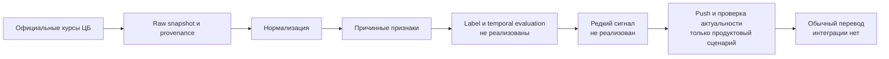

# Описание проекта

> Единый актуальный источник истины по состоянию репозитория. Документ основан на аудите кода, данных, отчётов, продуктовых артефактов и конфигурации. Планы и гипотезы ниже не выдаются за реализованный функционал или подтверждённый эффект.

| Поле | Значение |
| --- | --- |
| Название | «Выгодный момент» для трансграничного перевода RUB → TJS/UZS/KGS/AMD/KZT |
| Стадия | Исследовательский прототип: data pipeline, признаки и EDA готовы; signal/ML и продуктовый прототип не готовы |
| Целевой пользователь | Отправитель, регулярно переводящий деньги из RUB в одну из пяти валют и способный сдвинуть конкретный перевод во времени; семейный контекст — гипотеза сегментации, не универсальный факт |
| Основной сценарий | Редкая подсказка о статистически благоприятном моменте → открытие → проверка актуальности → переход в обычный перевод с выбранной только страной |
| Текущий статус | **Подготовлено и проверено:** официальный snapshot ЦБ, нормализация, quote-time/calendar-time, base/advanced features, EDA, 35 тестов. **Не реализовано:** labels, baseline, ML, backtest, функция сигналов на дату T, UI/API и интеграция |
| Ближайшая контрольная точка | До 7 сентября 2026 года: зафиксировать label и temporal evaluation, реализовать прозрачный baseline и воспроизводимый backtest; источник срока — `docs/BRIEF.md` и `docs/CONTEXT_PACK.md` |
| Дата актуализации | 4 сентября 2026 года |

## 1. Executive summary

Проект исследует, можно ли на открытой истории официальных валютных курсов находить редкие моменты, когда перевод из RUB в TJS, UZS, KGS, AMD или KZT статистически благоприятнее случайного дня. Канонический ряд — RUB за одну единицу валюты получателя: чем значение ниже, тем выгоднее положение для отправителя с фиксированным бюджетом RUB. Курс ЦБ используется только как воспроизводимый рыночный ориентир, а не как курс исполнения Альфа-Банка.

Фактически в репозитории реализован офлайн data/analytics-контур. Он динамически получает справочник валют ЦБ, сохраняет неизменённые SOAP-ответы и provenance, нормализует восемь рядов, строит причинные признаки для пяти целевых коридоров и два представления времени, а также содержит выполненный EDA. Snapshot покрывает 10 января 2019 года — 3 сентября 2026 года и включает 15 112 реальных наблюдений.

Ключевая продуктовая и ML-гипотеза пока **не подтверждена**. В репозитории нет формального label, temporal split, baseline, обученной модели, backtest-метрик, таблицы сигналов или функции «сигналы на дату T». Нет также runnable frontend/backend/API, push-механики, клиентских данных и интеграции с банковским переводом. Поэтому текущее доказательство — качество и причинность data pipeline, но не predictive power, клиентская ценность или бизнес-эффект.

## 2. Контекст, проблема и границы

### Проблема

Пользователь, который периодически переводит RUB за рубеж, вынужден сам отслеживать динамику курса и не знает, является ли текущий момент относительно благоприятным. Решение должно снизить эту когнитивную нагрузку, не обещая будущий курс и не мешая срочному переводу. Продуктовая постановка и ограничения зафиксированы в `docs/CASE.md`, `docs/BRIEF.md`, `docs/QA_ALIGNMENT.md` и `docs/CONTEXT_PACK.md`.

### Целевой контекст

- направления первой версии: RUB → TJS/UZS/KGS/AMD/KZT;
- основной исследовательский контекст: повторяющийся перевод с допустимым временным окном;
- срочность — характеристика конкретной операции, а не постоянный тип человека;
- получатель важен для ценности перевода, но не является прямым получателем сигнала;
- миграционный и семейный портреты остаются гипотезами до реального CustDev;
- путешественники, бизнес-переводы и перевод самому себе требуют отдельных формулировок и проверки.

### Жёсткие границы текущей версии

- только открытые официальные рыночные данные; внутренних банковских данных нет;
- публичный курс ЦБ не равен курсу исполнения, не содержит спред, комиссию и сумму к получению;
- никакого прогноза, гарантии, «лучшего курса» или персональной финансовой рекомендации;
- отрицательный или пограничный момент не порождает отдельный push: состояние по умолчанию — молчание;
- срочный перевод не блокируется и не оценивается как неправильный;
- deep link первой версии может задавать только страну; способ, получатель и сумма остаются выбором клиента;
- фиксация курса, реальные платежи, персонализация по транзакциям и production push — вне текущего scope;
- AI CustDev в `docs/interviews/` — синтетический stress-test вопросов, а не пользовательское исследование.

## 3. Продуктовое решение

Предлагаемый продукт — сигнальный слой внутри существующего пути трансграничного перевода:

1. Офлайн-алгоритм оценивает коридор на дату T только по информации, доступной не позже T.
2. Сильный и редкий повод может сформировать нейтральную подсказку с проверяемым фактом о прошлом/настоящем.
3. При открытии подсказки продукт повторно определяет статус: `актуально`, `изменилось` или `неизвестно`.
4. Пользователь переходит в обычный путь перевода; предвыбрана только страна.
5. При слабом поводе система молчит; при недоступности данных показывает `неизвестно`; обычный перевод остаётся доступным.



UX-путь, тексты и состояния описаны в `docs/USER_STORY_MAP.md`, `docs/ELASTIC_JOURNEY_MAP.md`, `docs/INELASTIC_JOURNEY_MAP.md` и `docs/CONTEXT_PACK.md`. Пять изображений в `docs/screenshots/` — референсы начала существующего банковского пути, а не доказательство собранного кликабельного прототипа. Финальные экраны после ввода суммы и подтверждения отсутствуют по `docs/ARTIFACT_VALIDATION_REPORT.md`.

## 4. Продуктовые гипотезы

Статус `Гипотеза` означает наличие проверяемого предположения, а не доказанный результат.

### 4.1. Активные и текущие

| ID | Гипотеза | Сегмент | Механизм | Метрика | Критерий успеха | Статус | Как проверить | Источник |
| --- | --- | --- | --- | --- | --- | --- | --- | --- |
| K-01 | На открытой истории можно находить редкие информативные моменты | Все 5 коридоров | Causal signal против random day | hit rate, lift, benefit, частота, кучность, OOT-устойчивость | lift ≥ 1,3, benefit > 0, 1–2 сигнала/неделю/коридор минимум для 2 коридоров | Гипотеза | Walk-forward backtest; ещё не реализован | `docs/CONTEXT_PACK.md` |
| ML-01 | Простая объяснимая `ML-Min` не хуже прозрачного правила | Все 5 коридоров | Собственный ряд коридора | те же метрики + объяснимость | общий порог и 1–3 факта на сигнал | Гипотеза | Сравнить правило и ML-Min на одинаковых split/label | `docs/CONTEXT_PACK.md` |
| ML-02 | `ML-Max` добавляет устойчивую ценность сверх `ML-Min` | Все 5 коридоров | Reversal, cross-FX, broad RUB, календарь | OOT lift и ablation | +0,05 медианного lift либо ещё один успешный коридор без ухудшения guardrails | Гипотеза | Walk-forward, ablation, OOT | `docs/CONTEXT_PACK.md` |
| H1 | Относительного факта достаточно без точной суммы выгоды | Отправитель с допустимым окном | Нейтральное объяснение динамики | понимание, start transfer, негативная реакция | понятнее нейтрального reminder без ощущения обещания | Гипотеза | Compliance review, content-test, пилот | `docs/CONTEXT_PACK.md` |
| H2 | Нейтральный путь не вредит срочному переводу | Срочный отправитель | Нет отрицательного push и блокировки | completion, early exit | не хуже нейтрального сценария | Гипотеза | UX-тест и пилот | `docs/CONTEXT_PACK.md` |
| H7 | Метка времени и статус актуальности повышают доверие | Все открывшие push | `актуально/изменилось/неизвестно` | понимание ограниченного срока, переход | меньше восприятия как гарантии без снижения перехода | Гипотеза | Прототипный A/B/content-test | `docs/CONTEXT_PACK.md` |
| H8 | Переход с выбранной страной снижает трение | Отправитель по известному коридору | Deep link только до страны | completion, time-to-transfer, ошибки, возвраты | выше completion без роста ошибок и поддержки | Гипотеза | UX-тест/пилот против общего экрана | `docs/CONTEXT_PACK.md`, `docs/LEAN_CANVAS.md` |
| H9 | Подсказка создаёт инкрементальные переводы, а не только сдвиг даты | Регулярный отправитель | Сигнал перед обычным переводом | net volume, completed transfers, repeat | положительный эффект против holdout | Гипотеза | 28-дневный holdout | `docs/CONTEXT_PACK.md`, `docs/LEAN_CANVAS.md` |
| H10 | Молчание в пограничные моменты лучше сохраняет доверие | Получатель коммуникаций | `no_signal` вместо осторожного push | opt-out, реакция на следующий сигнал, support | лучше контрольного policy при приемлемом охвате | Гипотеза | Backtest trade-off, затем pilot | `docs/CONTEXT_PACK.md` |
| H12 | «Благоприятный период» менее давит, чем «переведите сегодня» | Все сегменты | Непредписывающий текст | понимание, давление, start transfer | ниже давление без потери понимания | Гипотеза | Content-test и compliance review | `docs/CONTEXT_PACK.md` |

### 4.2. Отложенные, архивные и условные

| ID | Гипотеза | Причина текущего статуса | Статус | Следующая проверка | Источник |
| --- | --- | --- | --- | --- | --- |
| H3 | Волатильные коридоры дают больше воспринимаемой ценности, но выше риск недоверия | EDA измеряет волатильность, но не человеческую ценность | Запланировано | Сегментированный пилот | `docs/CONTEXT_PACK.md` |
| H4 | Основная аудитория — мигранты, переводящие семье | Клиентских когорт и реальных интервью нет | Не подтверждено | Рекрутинг по поведению, цели и срочности | `docs/CONTEXT_PACK.md`, `docs/personas/README.md` |
| H5/H11 | Сигнал полезнее для обычного коридора и рядом с привычным окном перевода | Нужна законная история операций; её нет | Заблокировано | Пилот после data/legal approval | `docs/CONTEXT_PACK.md` |
| H6 | Для семейного перевода «близкий получит больше» лучше абстрактного курса; для перевода самому себе нужен нейтральный текст | Семейный контекст не универсален; есть риск давления и нет execution amount | Запланировано | Раздельный content-test и compliance review | `docs/CONTEXT_PACK.md` |
| H8-extension | Предзаполнять способ, получателя и сумму | Нет клиентских данных; возрастает риск ошибочного действия | Запланировано | Отдельный пилот; не первая версия | `docs/CONTEXT_PACK.md`, `docs/QA_ALIGNMENT.md` |
| H13 | Доступного контекста достаточно поддержке для разбора жалобы | Нет signal log, клиентских событий и support-процесса | Заблокировано | Спроектировать audit log до пилота | `docs/CONTEXT_PACK.md` |

### 4.3. Новые гипотезы, следующие из аудита EDA

| ID | Гипотеза | Основание | Статус | Как проверить |
| --- | --- | --- | --- | --- |
| DA-01 | Комбинация высокого `favourability_percentile` и малого `dist_min` снижает future regret | Признаки описывают низкое положение курса, но predictive power не проверен | Предложение | Сначала формально определить future-regret label, затем walk-forward |
| DA-02 | Reversal после близости к минимуму полезнее одиночной смены знака | Fast и 2d события имеют разные частоты: 758 против 493 для epsilon 0,5% | Предложение | Одинаковый label, precision/coverage/benefit и anti-clustering |
| DA-03 | Порог reversal должен калиброваться отдельно по коридорам | EDA показывает разные волатильности и частоты событий | Предложение | Nested temporal calibration без использования test |
| DA-04 | `corridor_specific_return` добавляет сигнал сверх broad RUB | Коридоры сильно связаны с broad RUB, но имеют локальные остатки | Предложение | Ablation на OOT-окнах |
| DA-05 | Exact duplicate и почти коллинеарные признаки можно удалить без потери качества | Найдены 4 точных дубликата и 70 пар с `abs(corr)>0,995` | Предложение | Train-only feature selection и OOT ablation |

Основание новых гипотез — `reports/eda_findings.md`; это направления экспериментов, а не результаты.

## 5. Архитектура и технологический стек

| Область | Реализация / технология | Статус | Обоснование и ограничения |
| --- | --- | --- | --- |
| Frontend | Отсутствует | Не подтверждено | Есть UX-документы и screenshots, но нет runnable UI |
| Backend | Отсутствует | Не подтверждено | Нет сервера, endpoint сигналов или бизнес-логики перевода |
| API проекта | Отсутствует | Не подтверждено | Используется только внешний SOAP API ЦБ |
| Data ingestion | Python stdlib: `urllib`, `xml.etree`, retry/backoff, atomic writes | Реализовано | `src/pipeline/download.py`; cache и `--force-download` |
| Нормализация | Python, pandas, pyarrow | Реализовано | `src/normalization.py`; quote/calendar datasets |
| Аналитика | pandas, NumPy, Jupyter | Реализовано | Feature modules и выполненный notebook |
| ML | Нет обучающего/инференс-кода | Запланировано | `ML-Min`/`ML-Max` описаны только как экспериментальный контракт |
| Хранилище | XML/JSON/CSV/Parquet в Git | Реализовано | Локальные immutable raw snapshots и производные файлы; БД нет |
| Визуализация | Jupyter/Matplotlib-выводы в notebook | Подготовлено | 117 графиков, но нет dashboard |
| Тестирование | pytest | Проверено | 35 тестов: ingestion, normalization, base, advanced, calendar |
| Инфраструктура | Локальный Python-проект | Подготовлено | Нет контейнера, оркестратора или облачных ресурсов |
| Deployment | Отсутствует | Не подтверждено | Нет CI/CD, package release, service deployment |
| Monitoring | Отсутствует | Запланировано | NFR описывает будущие события и SLO, фактического monitoring нет |
| Dev tooling | Python 3.13, Ruff, pre-commit, pytest | Подготовлено | `pyproject.toml`, `ruff.toml`, `.pre-commit-config.yaml`; lock-файл отсутствует |

Основные runtime-версии зафиксированы в `pyproject.toml`: Python `>=3.13,<3.14`, NumPy `2.2.6`, pandas `3.0.5`, PyArrow `25.0.1`, tabulate `0.9.0`. Dev-зависимости заданы нижними границами, а `uv.lock` отсутствует и игнорируется, поэтому полностью идентичное dev-окружение не гарантировано.

## 6. Данные

### 6.1. Источник и provenance

Единственный production-источник market data — официальный SOAP web-service Банка России `DailyInfo`: endpoint `https://www.cbr.ru/DailyInfoWebServ/DailyInfo.asmx`. Метод `EnumValutesXML(Seld=false)` динамически разрешает ISO-коды во внутренние `Vcode`; `GetCursDynamicXML(FromDate, ToDate, ValutaCode)` возвращает историю. Подробности и ручная сверка трёх USD-значений с публичной страницей ЦБ находятся в `docs/source_research.md`.

Для каждого raw-ответа сохранены endpoint, параметры, timestamp UTC, внутренний идентификатор, фактический диапазон, число строк, путь, размер и SHA-256 в `data/raw/cbr/2019-01-01_2026-09-03/download_manifest.json` и `*.request.json`. Raw XML сохраняется byte-for-byte. Явная лицензия/условия повторного распространения в репозитории не зафиксированы; файл `LICENSE` отсутствует — это открытый юридический вопрос, а не техническое подтверждение права использования.

### 6.2. Направление, дата и схема

- `raw_rate = Vcurs`: RUB за `nominal=Vnom` единиц валюты;
- `unit_rate = VunitRate`, либо проверяемое `raw_rate / nominal`: RUB за 1 единицу валюты;
- меньшее `unit_rate` выгоднее отправителю RUB при фиксированном бюджете;
- `CursDate` приходит с `+03:00`; в Parquet хранится civil date как pandas datetime без отдельного поля timezone;
- `source_quote_date` сохраняет дату последней реальной котировки;
- `is_new_quote=False` означает calendar forward fill и никогда не означает новое движение рынка.

Базовая нормализованная схема: `date`, `currency`, `source_currency`, `target_currency`, `source_identifier`, `nominal`, `raw_rate`, `unit_rate`, `source_quote_date`, `is_new_quote`, `source`, `source_endpoint`. Calendar-time добавляет `days_since_new_quote`.

### 6.3. Snapshot и наборы данных

Запрошено `2019-01-01`–`2026-09-03`; фактическая общая история начинается `2019-01-10`. Валюты TJS, UZS, KGS, AMD, KZT, USD, EUR и CNY содержат по 1 889 реальных наблюдений, всего 15 112. Внутренние идентификаторы и raw checksums не hardcoded в pipeline и перечислены в manifest.

| Артефакт | Ось времени | Строки × столбцы | Диапазон | SHA-256 | Статус |
| --- | --- | ---: | --- | --- | --- |
| `data/interim/cbr_fx_normalized.parquet` | quote-time | 15 112 × 12 | 2019-01-10–2026-09-03 | `0f949153cce2e9158446568fb8dac6f9a6313e2e174ccfce28ec4c1112349137` | Проверено |
| `data/interim/fx_quote_time.parquet` | quote-time | 15 112 × 12 | 2019-01-10–2026-09-03 | `0f949153cce2e9158446568fb8dac6f9a6313e2e174ccfce28ec4c1112349137` | Проверено |
| `data/interim/fx_calendar_time.parquet` | calendar-time | 22 352 × 13 | 2019-01-10–2026-09-03 | `d4cf441cb152be68b83ab0f51ab81fd9c3bd9f132f25edf51dd318d147dfe4e5` | Проверено |
| `data/features/base_market_features.parquet` | quote-time, 5 коридоров | 9 445 × 67 | 2019-01-10–2026-09-03 | `235d4b01ceac4c4894a65772c74ebd9258622f1452607904bd7aeb7830f00b4a` | Проверено |
| `data/features/fx_features_daily.parquet` | quote-time, 5 коридоров | 9 445 × 104 | 2019-01-10–2026-09-03 | `6737d1ebec82f66b04f431c79d79680a7d5d8b775e6a335c133ef3d49efcd131` | Проверено |
| `data/features/fx_features_calendar_daily.parquet` | calendar-time, 5 коридоров | 13 970 × 107 | 2019-01-10–2026-09-03 | `e9f80c0a757b3a732163d4fc630b0043742b5ae74cd809f0a8a3a7ca5188acb0` | Проверено |

`cbr_fx_normalized.parquet` и `fx_quote_time.parquet` сейчас побайтно совпадают. Восьмивалютный calendar-time содержит 7 240 добавленных строк; feature calendar — 4 525 добавленных строк и 9 445 реальных.

### 6.4. Номиналы и качество

Исторические номиналы нельзя заменять современным справочным значением. Обнаружены CNY `1/10`, KGS `10/100`, TJS `1/10`, UZS `1 000/10 000`; AMD и KZT — `100`, USD и EUR — `1`. Pipeline сохраняет исходные `nominal` и `raw_rate`, проверяет положительность, обязательные поля, сортировку, уникальность и тождество unit rate с допуском `1e-12`.

Фактические DQ-результаты по `docs/dataset_card.md` и отчётам:

- raw ingestion, normalization, base и advanced features: PASS;
- дубликаты `currency+date` и `corridor+date`: 0;
- source quote dates из будущего: 0;
- неожиданные NaN после causal warm-up: 0;
- cross-currency identity: max absolute/relative error 0;
- 224 экстремальные строки помечены для ручной сверки и не удалены;
- пропуски начала окон сохранены как NaN, не заполнены;
- отсутствующие календарные даты добавлены только в явно отдельные calendar-time артефакты причинным forward fill.

### 6.5. Семейства признаков

| Семейство | Примеры | Семантика | Реализовано |
| --- | --- | --- | --- |
| Returns | `ret_1/2/3/5/10/20`, `log_ret_1` | Изменение RUB-цены; отрицательное обычно благоприятно отправителю | Да |
| Trend/means | `sma_5/10/20/60`, `dist_sma_*`, `sma_5_vs_20` | Положение относительно trailing average | Да |
| Extrema | `rolling_min/max_*`, `dist_min/max_*`, `days_since_min_*` | Близость и возраст локальных экстремумов | Да |
| Rank/favourability | `percentile_*`, `favourability_percentile_*` | Только N прошлых наблюдений; T исключён | Да |
| Momentum/streak | `mom_*`, `down_streak`, `up_streak` | Направление и длина серии | Да |
| Volatility/range | `vol_*`, `rolling_range_*` | Историческая изменчивость без annualization | Да |
| Reversal | `return_sign_reversal_up`, `near_min_reversal_*`, `reversal_2d_*` | Смена направления около trailing minimum | Да |
| Cross-FX | `recipient_usd_implied`, его returns | Implied USD за единицу валюты получателя | Да |
| Broad RUB | `broad_rub_return_*`, `broad_rub_z_*` | Равновзвешенная корзина USD/EUR/CNY; не официальный индекс | Да |
| Corridor-specific | `corridor_specific_return_*` | Доходность коридора минус broad RUB | Да |
| Freshness | `*_source_quote_date`, `*_freshness_days` | Возраст последней допустимой опорной котировки | Да |
| Calendar/user/holiday | Праздники, salary window, клиентская история | Не входят в текущий market dataset | Нет |

Формулы base признаков задокументированы в `docs/base_feature_dictionary.md`, cross-FX — в `docs/cross_currency_methodology.md`.

### 6.6. Alignment, lineage и leakage

Линия происхождения: raw SOAP → validated normalized quote-time → base features → advanced quote-time → optional calendar expansion. USD/EUR/CNY присоединяются `merge_asof(direction="backward")`: используется последняя дата `<=T`, backfill запрещён. На текущем snapshot даты реальных котировок совпадают, поэтому freshness reference currencies фактически равна нулю; устойчивость к несовпадающим датам покрыта логикой и unit tests, но не разнообразием production snapshot.

Защиты от leakage: trailing windows, `shift` только в прошлое, percentile исключает T, z-score использует предыдущие 60 значений, causality recomputation на 20 base и 30 advanced парах дата/коридор. Глобальной нормализации нет. Нерешённый риск: `CursDate` не равна точному `available_at`; публикационный лаг до моделирования сигналов не определён.

### 6.7. Чего в данных нет

Нет курса исполнения приложения, спреда, комиссии, суммы к получению, intraday-котировок, фактов переводов, целей перевода, клиентских когорт, push-событий, labels и model predictions. Поэтому нельзя рассчитывать реальную экономию клиента, причинный бизнес-эффект или персональную релевантность.

## 7. Data pipeline

| Этап | Вход | Выход | Основные проверки | Статус |
| --- | --- | --- | --- | --- |
| Source discovery | CBR SOAP/WSDL и публичная страница | `data/raw/source_discovery/`, mapping | 8 валют найдены; 3 USD значения совпали | Проверено |
| Reference discovery | `EnumValutesXML` | `data/reference/cbr_currency_codes.csv` | Динамический ISO→Vcode, неоднозначность = ошибка | Реализовано |
| Raw ingestion | CBR `GetCursDynamicXML` | 8 XML, request JSON, manifest | retry/backoff, timeout, cache, SHA, ≥5 лет | Проверено |
| Normalization | Сохранённые XML | 3 interim Parquet | типы, rate/nominal, uniqueness, chronology | Проверено |
| Base features | quote-time | `base_market_features.parquet` | no calendar fill, formulas, causality | Проверено |
| Advanced features | quote-time + base | `fx_features_daily.parquet` | backward as-of, identity, causality | Проверено |
| Calendar expansion | advanced quote-time | `fx_features_calendar_daily.parquet` | последовательные даты, markers/freshness | Проверено |
| EDA | advanced quote-time | notebook + `eda_findings.md` | schema, missingness, outliers, redundancy | Подготовлено |
| Labeling | Будущие значения только здесь | Отдельный label artifact | horizon, sign, tail exclusion | Запланировано |
| Temporal split | features + labels | train/validation/test | walk-forward, purge/embargo | Запланировано |
| Baseline/ML/backtest | temporal datasets | scores, signals, metrics | random baseline, OOT, frequency/clustering | Запланировано |
| Product delivery | validated signal | UI/push/deep link/audit log | freshness, safe degradation, guardrails | Не подтверждено |

Raw download — единственный сетевой этап. Downstream-модули работают с сохранённым snapshot и при критической ошибке завершаются exception, не подменяя источник synthetic/mock data.

## 8. Модели, алгоритмы и сигнальная логика

| Компонент | Назначение | Фактический статус | Ограничение/условие выбора |
| --- | --- | --- | --- |
| Descriptive feature rules | Выделять положение, тренд, reversal и broad context | Реализовано как признаки, но не как сигнал | Порогов и validated decision rule нет |
| Random-day baseline | База для lift | Запланировано | Должна совпадать по коридору/периоду и календарной базе |
| Transparent rules baseline | Простая объяснимая политика | Запланировано | Сравнивается первой на том же label/split |
| `ML-Min` | Простая классическая модель на собственном ряду | Гипотеза | Использовать только при OOT результате не хуже правила и понятном объяснении |
| `ML-Max` | Расширенная модель с reversal/cross-FX/calendar | Гипотеза | Только устойчивый incremental gain и ablation; complexity не самоцель |
| Threshold/push policy | Преобразовать score в редкий сигнал | Запланировано | Отдельная temporal calibration, 1–2/неделю/коридор, anti-clustering |
| Generative AI | Решение send/no-send | Не используется | Прямо запрещено экспериментальным контрактом |

Label пока не определён ни формулой, ни кодом. Future values допустимы только при его построении и оценке. До этого нельзя утверждать, что reversal, low percentile или иной state предсказывает благоприятный будущий исход.

Минимальная модель должна быть проще и легче объяснима; полная модель допускается только после сравнения с rule baseline и `ML-Min`. В обоих случаях split только temporal, scaling/selection fit только на train, а purge/embargo должен быть не короче максимального label horizon.

Цена false positive выше обычной ошибки классификации: давление, потеря доверия, отписка и переход к конкуренту. False negative означает пропущенную коммуникацию, но не блокирует перевод. Поэтому precision, редкость, стабильность и объяснимость важны вместе с hit rate.

## 9. Первые результаты и доказательства

| Результат | Значение | Что доказывает | Чего не доказывает | Источник |
| --- | --- | --- | --- | --- |
| Source validation | 8/8 валют, 3/3 ручных USD совпадения | Официальность и корректность способа получения | Полноту будущих обновлений | `docs/source_research.md` |
| Raw snapshot | 15 112 строк, 2019-01-10–2026-09-03 | Достаточное историческое покрытие | Предсказуемость рынка | `reports/raw_data_report.md` |
| Pipeline tests | 35 passed | Инварианты текущего кода | Production SLA и model quality | `tests/`, `docs/dataset_card.md` |
| Causality checks | 20 base + 30 advanced пар PASS | Пересчёт до T совпадает с full-history features на T | Корректность будущего label/split | `reports/base_features_report.md`, `reports/advanced_features_report.md` |
| EDA completeness | 9 445 × 104, 0 duplicates, 0 unexpected mature NaN | Feature dataset технически пригоден к следующему этапу | Predictive power | `reports/eda_findings.md` |
| Outlier review queue | 224 строки | Аномалии не скрыты и не удалены | Что все они корректны | `reports/eda_findings.md` |
| Reversal counts | 758 fast и 493 2d при epsilon 0,5%; 2 125 sign reversals | Сигналы различаются coverage/delay | Какой сигнал полезнее | `reports/eda_findings.md` |
| Broad correlation | `ret_1` корреляции 0,810–0,950 по коридорам | Сильный общий RUB-компонент | Причинность и future performance | `reports/eda_findings.md` |
| Redundancy | 4 exact duplicate пары, 70 пар `abs(corr)>0,995` | Нужна контролируемая selection/ablation | Что удаление улучшит модель | `reports/eda_findings.md` |

Режим повышенной волатильности 2022 года визуально выделяется, что повышает риск structural drift. Все EDA-выводы описательные.

## 10. Метрики и критерии успеха

| Уровень | Метрика / формула | Порог | Источник | Текущая доступность |
| --- | --- | --- | --- | --- |
| North Star будущего продукта | Разница среднего чистого объёма завершённых трансграничных переводов на клиента между treatment и holdout за фиксированный период | Не утверждён; рабочий ориентир +5% требует согласования | `docs/LEAN_CANVAS.md` | Нет клиентских данных |
| Offline hit rate | `успешные сигналы / все сигналы`; точное определение успеха зависит от ещё не заданного label | Не зафиксирован отдельно | `docs/CONTEXT_PACK.md` | Нет label/сигналов |
| Offline lift | `hit_rate(signal) / hit_rate(random baseline)` в том же коридоре и периоде | ≥ 1,3 | `docs/QA_ALIGNMENT.md`, `docs/CONTEXT_PACK.md` | Не рассчитан |
| Moment benefit | Улучшение будущего результата относительно базы в basis points; точная формула не зафиксирована | Статистически > 0 | `docs/LEAN_CANVAS.md` | Не рассчитан |
| Горизонты | Календарные h = 1/3/5/10/20 | Все горизонты должны быть показаны | `docs/QA_ALIGNMENT.md` | Нет label |
| Signal frequency | Сигналы/неделя/коридор | 1–2 | `docs/CONTEXT_PACK.md` | Нет policy |
| Stability | Результат по нескольким коридорам и OOT walk-forward окнам | Минимум 2 успешных коридора для SMART-гипотезы | `docs/CONTEXT_PACK.md` | Не рассчитан |
| Activation | Open push и start transfer в предзаданном окне | Не утверждён | `docs/LEAN_CANVAS.md` | Нет событий |
| Retention | Repeat transfer; отсутствие роста opt-out | Не утверждён | `docs/LEAN_CANVAS.md` | Нет событий |
| Business | Incremental completed transfers и net volume против holdout | Рабочий +5% volume/client не согласован | `docs/LEAN_CANVAS.md` | Нет пилота |
| Guardrails | Early exit, opt-out, error/refund, support contacts | Stop conditions не утверждены | `docs/NFR.md` | Нет пилота |
| SLI/SLO | p95 latency, availability, freshness, incident recovery | Числовые SLA/RTO/RPO не утверждены; p95 ≤2s только ориентир | `docs/NFR.md` | Не измеряется |
| Data acceptance | PASS стадий, uniqueness, positivity, checksum, causality | Все критические проверки PASS | Код и reports | Доступно, PASS |

Критический пробел: label и benefit formula необходимо pre-register до эксперимента. Иначе выбор определения после просмотра результатов создаст исследовательскую подгонку.

## 11. Нефункциональные требования

| Категория | Требование текущей версии | Статус | Пробел до пилота/production |
| --- | --- | --- | --- |
| Performance | Воспроизводимый расчёт на T; сигнал не блокирует перевод | Частично подготовлено | Runtime не измерен; p95 и load неизвестны |
| Reliability | Ошибка/устаревание → `неизвестно`; ordinary transfer доступен | Описано | Нет работающего product layer и incident owner |
| Integrity | Source/date/rule version/input slice на каждый сигнал | Запланировано | Signal audit log отсутствует |
| Security | Только public data, без ПДн/секретов; country-only link | Подготовлено для data repo | Secret scan и product implementation не представлены |
| Compliance | Только проверяемый факт; без forecast/guarantee/execution claim | Описано | Конкретные тексты не согласованы |
| Scalability | Отдельные результаты по 5 коридорам | Реализовано для features | DAU, concurrency и growth неизвестны |
| Maintainability | Модульный CLI, docs, tests, явные assumptions | Частично проверено | Нет lock, CI и release process |
| Observability | Трассировка source→signal→text; pilot events | Запланировано | Signal table и telemetry отсутствуют |
| Compatibility | Сохранить текущий путь мобильного перевода | Описано | Нет runnable integration; версии iOS/Android неизвестны |
| Data lifecycle | Raw provenance и публичные данные; нет real user data | Реализовано | Retention, backup, deletion, localization не определены |
| i18n | Пять направлений и однозначные единицы | Частично подготовлено | Язык, locale, client timezone неизвестны |
| Accessibility | Статус не только цветом; текст понятен без графика | Описано | Реальный accessibility/content test не проведён |

`docs/NFR.md` оценивает уровень неопределённости требований как `0,75`; это не оценка качества продукта. Числовые production SLA, availability, quiet hours, RTO/RPO, нагрузка и legal scope не утверждены.

## 12. Текущий прогресс

### Сделано

- source discovery и ручная проверка официальных данных;
- raw ingestion с cache/retry/backoff/provenance/checksum;
- нормализация и два временных представления;
- base, reversal, cross-currency, broad RUB и freshness features;
- calendar-expanded feature dataset;
- выполненный EDA и технические отчёты;
- unit/integration-style tests текущего data pipeline;
- продуктовые документы, user story map, journey maps, NFR и hypotheses registry.

### Частично сделано

- discovery: много артефактов, но нет реальных пользовательских интервью;
- UX: сценарий описан, но runnable prototype и финальные экраны не подтверждены;
- воспроизводимость: команды и версии есть, но отсутствует lock и CI;
- observability: provenance data есть, signal/pilot logs нет.

### Не начато или не подтверждено

- label и labels artifact;
- walk-forward split, purge/embargo;
- random/rules baseline;
- ML-Min/ML-Max обучение и selection;
- backtest, signal table, функция «на дату T»;
- backend/API/frontend/push/deep link implementation;
- реальный CustDev, compliance approval и holdout pilot.

| Направление | Готовность | Вердикт аудита |
| --- | --- | --- |
| Product discovery | Высокая документальная, низкая эмпирическая | Подготовлено, не подтверждено пользователями |
| UX/prototype | Сценарий и карты есть | Частично; runnable prototype не найден |
| Data | Snapshot и provenance готовы | Проверено |
| Pipeline | Ingestion→features работает | Проверено |
| Label | Только требования к будущей работе | Не подтверждено |
| Baseline | Описан как обязательный порядок | Не подтверждено |
| ML | Только гипотезы и feature inputs | Не подтверждено |
| Backtest | Метрики описаны | Не подтверждено |
| Integration | Нет app/backend/API | Не подтверждено |
| Demo | В tracked repo нет подтверждённого runnable demo | Не подтверждено |

Формулировка `GO для discovery-этапа и перехода к прототипу` в `docs/ARTIFACT_VALIDATION_REPORT.md` подтверждается как оценка согласованности документов. Она не подтверждает готовность прототипа, модели или production-запуска.

## 13. План до финала

Дедлайн 7 сентября 2026 года указан в `docs/BRIEF.md` и `docs/CONTEXT_PACK.md`. Ниже — вывод аудита, а не согласованный командный backlog.

### Must have до финала

| Приоритет | Задача | Definition of Done | Зависимости | Риски | Сложность | Статус |
| --- | --- | --- | --- | --- | --- | --- |
| P0 | Зафиксировать label contract | Формула, знак, h=1/3/5/10/20, calendar base, tail policy, available_at, random baseline записаны до просмотра metric | Product+ML decision | Researcher degrees of freedom | M | Предложение |
| P0 | Реализовать labels отдельно от features | Версионированный artifact, future только в label, tests, no overlap/leakage | Label contract | Off-by-one/calendar leakage | M | Запланировано |
| P0 | Реализовать walk-forward evaluation | Train/val/test по времени, purge/embargo ≥ max horizon, per-corridor windows | Labels | Мало независимых режимов | M | Запланировано |
| P0 | Реализовать random и transparent rule baseline | Таблица дата×коридор×score/decision/reason; одинаковые split/label | Temporal dataset | Post-hoc thresholds | M | Запланировано |
| P0 | Выпустить backtest report и функцию на T | lift, benefit, frequency, clustering, stability; воспроизводимый CLI на произвольную T | Baseline | SMART-гипотеза может не пройти | L | Запланировано |
| P1 | Проверить 224 экстремальные строки | Связь с raw подтверждена или documented issue; без silent deletion | Raw snapshot | Временные затраты | S | Предложение |
| P1 | Собрать минимальный demo state flow | `актуально/изменилось/неизвестно`, urgent neutral path, country-only link; явно mock UI без real transfer | Signal examples | Нет app assets/integration | M | Запланировано |

### Если останется время

| Приоритет | Задача | Definition of Done | Зависимости | Риски | Сложность | Статус |
| --- | --- | --- | --- | --- | --- | --- |
| P2 | ML-Min | Temporal tuning, calibration, explanations, сравнение с rule | P0 backtest | Overfit | M | Гипотеза |
| P2 | Feature ablation | Exact duplicates удалены/оставлены по OOT evidence | ML-Min | Нестабильность режимов | M | Предложение |
| P2 | ML-Max | Только если выполняется incremental criterion | ML-Min | Complexity без gain | L | Гипотеза |
| P2 | Зафиксировать окружение | Lock-файл, clean-run instructions, CI test | Стабильный код | Разные platform wheels | S | Предложение |

### После финала / перед пилотом

Реальный CustDev и content-test; compliance/legal approval; intraday/execution-data decision; product backend/API; push policy и quiet hours; signal audit log; telemetry; holdout design; numerical guardrails; SLO/SLA/RTO/RPO; security/accessibility review; data retention и incident process.

## 14. Риски и открытые вопросы

| Риск / вопрос | Вероятность/влияние | Текущая защита | Что нужно решить |
| --- | --- | --- | --- |
| Публичный CBR rate ≠ execution rate | Высокое влияние | Явный disclaimer во всех data docs | Можно ли получить воспроизводимый execution proxy |
| Label не определён | Критическое | Future запрещён в features | Pre-register формулу и горизонты |
| Неизвестен publication lag/`available_at` | Критическое для T | Causal по `CursDate` | Правило доступности значения на момент решения |
| Calendar fill создаёт искусственные нулевые движения | Высокое | Отдельный dataset и `is_new_quote` | Как label/random base трактуют выходные |
| Structural drift, особенно 2022 | Высокое | OOT/walk-forward запланирован | Окна и regime robustness |
| Feature redundancy | Среднее | Не удаляется до temporal evaluation | Train-only selection/ablation |
| 224 экстремальных наблюдения | Среднее | Сохранены и помечены | Ручная raw verification |
| Низкая частота даёт мало пилотных событий | Высокое | 28-дневный holdout предложен | Реалистичная длительность и sample size |
| Семейный framing может давить/ошибаться | Высокое | Нейтральный default | Сегментация и content/compliance test |
| Устаревший push | Высокое | Три статуса описаны | TTL и источник текущих условий |
| Нет реальных user evidence | Высокое | AI CustDev честно помечен | Провести реальные интервью |
| Нет runnable product architecture | Высокое | Scope обозначен | Выбрать integration contract |
| Нет lock/CI | Среднее | Exact runtime pins и tests | Lock и automated clean-run |
| Правовой статус данных/текстов | Высокое | Public-only, no PII | License/use terms и legal approval |

## 15. Решения и допущения

| Решение / допущение | Тип | Статус | Основание |
| --- | --- | --- | --- |
| Канонический rate — RUB за 1 единицу валюты получателя | Техническое решение | Проверено | CBR `VunitRate` и `Vcurs/Vnom` |
| Меньше rate — лучше отправителю RUB | Семантика задачи | Проверено математически | Фиксированный RUB бюджет |
| CBR — reference, не execution | Продуктовое ограничение | Подтверждено кейсодателем | `docs/QA_ALIGNMENT.md` |
| Только public data в текущем контуре | Scope | Реализовано | Нет внутренних выгрузок |
| Country-only deep link | Решение команды | Подготовлено в документах | Минимизация ошибочного действия |
| Молчание в weak/negative state | Решение команды | Гипотеза | Защита доверия и срочного пути |
| Частота 1–2/неделю/коридор | Self-check модели | Гипотеза | Не заменяет client contact policy |
| Calendar-time допускает causal forward fill | Data representation | Реализовано | Строки явно маркированы |
| Quote windows — observations, не calendar days | Техническое решение | Реализовано | `docs/base_feature_dictionary.md` |
| USD/EUR/CNY broad factor равновзвешенный | Аналитическое допущение | Реализовано | Не официальный индекс; требует ablation |
| ML-Max только после устойчивого gain | Экспериментальное решение | Подготовлено | Конституция и Context Pack |
| Семейный/мигрантский портрет — не факт | Research constraint | Не подтверждено | Нет реального CustDev/когорт |

## 16. Карта репозитория

```text
.
├── README.md                     # навигация и краткий статус
├── description.md                # этот единый актуальный обзор
├── pyproject.toml                # runtime/dev dependencies
├── data/
│   ├── raw/source_discovery/     # ограниченные probe-ответы и provenance
│   ├── raw/cbr/.../              # production SOAP snapshot, requests, manifest
│   ├── reference/                # справочник валют ЦБ
│   ├── interim/                  # normalized quote/calendar time
│   └── features/                 # base, advanced, calendar feature datasets
├── src/
│   ├── pipeline/                 # ingestion CLI и download logic
│   ├── normalization.py          # parsing, normalization, validation, save
│   └── features/                 # base, advanced, calendar transformations
├── tests/                        # 5 test modules data/feature pipeline
├── reports/                      # stage reports и EDA findings
├── notebooks/                    # выполненный feature EDA
├── docs/                         # product, source, data, methodology, NFR, UX
├── scripts/                      # source discovery и history validation
└── .specify/                     # project constitution/templates/scripts
```

В репозитории не найдены `models/`, `labels/`, app/frontend/backend/API, Dockerfile/Compose, CI workflow или deployment manifest.

## 17. Воспроизведение текущего состояния

### Окружение

Требуется Python 3.13. Runtime-зависимости точно перечислены в `pyproject.toml`; отсутствие lock-файла ограничивает полную воспроизводимость dev-окружения.

```powershell
python -m pip install numpy==2.2.6 pandas==3.0.5 pyarrow==25.0.1 tabulate==0.9.0 pytest
python -m pytest -q
```

### Пересборка из уже сохранённого raw snapshot

```powershell
python -m src.normalization --raw-dir data/raw/cbr --output-dir data/interim
python -m src.features.base_features
python -m src.features.advanced_features
python -m src.features.calendar_features
```

Эти команды перезаписывают соответствующие derived Parquet/reports, но не должны обращаться к сети. Перед сравнением рекомендуется вычислить SHA-256 и сверить значения из раздела 6.3.

### Raw ingestion

```powershell
python -m src.pipeline download --start-date 2019-01-01 --end-date 2026-09-03
```

Команда использует официальный endpoint и cache; повторная загрузка требует явного `--force-download`. Сетевой rerun может получить другой snapshot при ревизии источника, поэтому для воспроизведения текущих features предпочтительны уже сохранённые raw-файлы.

### EDA

`notebooks/01_fx_features_eda.ipynb` уже содержит выполненные output cells. Для интерактивного просмотра нужен пакет `notebook`; отдельного CLI для воспроизводимой генерации EDA-report в репозитории нет.

Нет команды для labels, training, backtest, inference, API или demo, потому что соответствующий код отсутствует.

## 18. Итоговая готовность

| Цель | Готовность | Итог |
| --- | --- | --- |
| Повторно получить официальный исторический snapshot | Высокая | PASS при доступности ЦБ; cache/provenance реализованы |
| Пересобрать normalized/features из raw | Высокая | PASS; tests и stage reports есть |
| Начать проектирование label/model experiment | Высокая | Данные и EDA готовы |
| Доказать ключевую SMART-гипотезу | Низкая | FAIL: нет label/backtest/signals |
| Показать работающий end-to-end product demo | Низкая | Не подтверждено: нет runnable UI/API |
| Запустить пилот | Нулевая/низкая | Заблокировано данными, интеграцией, legal/compliance и experiment design |
| Production deployment | Не готово | Не входит в текущий scope; NFR существенно не определены |

Текущий честный вердикт: **DATA/FEATURE PIPELINE — PASS; EDA — PASS как описательный анализ; SIGNAL VALIDATION — FAIL/не выполнена; PRODUCT DEMO — не подтверждён; PILOT/PRODUCTION — не готовы.**

Три ближайшие задачи: (1) зафиксировать label contract и `available_at`; (2) реализовать temporal labels/split и прозрачный baseline; (3) выпустить backtest + функцию сигналов на T с таблицей объяснений и метрик.

## Приложение A. Глоссарий

| Термин | Значение в проекте |
| --- | --- |
| Коридор | Целевая пара получатель/RUB, например `TJS_RUB`, где rate — RUB за 1 TJS |
| Quote-time | Только даты реальных официальных котировок |
| Calendar-time | Все календарные даты с causal forward fill и явной маркировкой |
| `is_new_quote` | `True` для реальной source quote; `False` для перенесённого последнего значения |
| Freshness | Возраст последней использованной реальной котировки в календарных днях |
| Label | Будущий исход, допустимый только для target/evaluation; пока отсутствует |
| Future regret | Потенциальное ухудшение относительно лучшего будущего значения; формула ещё не утверждена |
| Lift | Отношение hit rate сигнала к hit rate согласованной random baseline |
| OOT | Out-of-time проверка на более позднем, не использованном для fit периоде |
| Purge/embargo | Временной зазор, предотвращающий пересечение информации label между split |
| Broad RUB | Неофициальный равновзвешенный фактор returns USD/EUR/CNY к RUB |
| Execution rate | Фактический клиентский курс; в текущих данных отсутствует |

## Приложение B. Сокращения

| Сокращение | Расшифровка |
| --- | --- |
| ЦБ/CBR | Банк России / Central Bank of Russia |
| FX | Foreign exchange |
| EDA | Exploratory data analysis |
| ML | Machine learning |
| DQ | Data quality |
| PII/ПДн | Персональные данные |
| NFR | Non-functional requirements |
| SLI/SLO/SLA | Индикатор, цель и соглашение уровня сервиса |
| RTO/RPO | Цели времени и точки восстановления |
| UX | User experience |

## Приложение C. Основные источники внутри репозитория

- продукт и ограничения: `docs/CASE.md`, `docs/BRIEF.md`, `docs/QA_ALIGNMENT.md`, `docs/CONTEXT_PACK.md`, `docs/LEAN_CANVAS.md`;
- UX: `docs/USER_STORY_MAP.md`, `docs/ELASTIC_JOURNEY_MAP.md`, `docs/INELASTIC_JOURNEY_MAP.md`, `docs/screenshots/`;
- NFR и аудит артефактов: `docs/NFR.md`, `docs/ARTIFACT_VALIDATION_REPORT.md`, `.specify/memory/constitution.md`;
- источник и pipeline: `docs/source_research.md`, `docs/pipeline_plan.md`, `src/pipeline/`, `src/normalization.py`;
- данные и признаки: `docs/dataset_card.md`, `docs/base_feature_dictionary.md`, `docs/cross_currency_methodology.md`, `src/features/`;
- фактические stage results: `reports/raw_data_report.md`, `reports/normalization_report.md`, `reports/base_features_report.md`, `reports/advanced_features_report.md`, `reports/eda_findings.md`;
- tests: `tests/test_raw_ingestion.py`, `tests/test_normalization.py`, `tests/test_base_features.py`, `tests/test_advanced_features.py`, `tests/test_calendar_features.py`.

## Приложение D. Противоречия и расхождения, найденные аудитом

| Тема | Источник A | Источник B / факт репозитория | Актуальная трактовка |
| --- | --- | --- | --- |
| Готовность прототипа | `docs/ARTIFACT_VALIDATION_REPORT.md`: GO к прототипу/защите | Нет runnable UI/API; отсутствуют финальные экраны | GO относится к согласованности discovery-документов, не к реализованному продукту |
| Имя advanced dataset | `fx_features_daily.parquet` | `docs/dataset_card.md` и код: только quote observations | Использовать как quote-time; daily calendar — отдельный файл |
| Термины ML-признаков | `docs/CONTEXT_PACK.md`: `return_1d`, `MA_*` | Код: `ret_*`, `sma_*` | Context Pack концептуален; контракт схемы задаёт фактический Parquet/dictionary |
| NFR signal observability | `docs/NFR.md`: таблица сигналов обязательна сейчас | Signal/backtest модулей нет | Требование не выполнено, а не реализовано косвенно features |
| Воспроизводимость окружения | `README.md`/NFR требуют независимый запуск | `uv.lock` отсутствует, dev versions не pinned точно | Data transformations воспроизводимы по snapshot, environment — частично |
| Описание пакета | Продукт подробно описан в docs | `pyproject.toml`: `description = "Add your description here"` | Packaging metadata устарело; не изменено из-за scope этого задания |
| Calendar observations | Конституция запрещает fabricated market observations | Calendar datasets добавляют строки forward fill | Не конфликтует только при обязательном `is_new_quote=False` и запрете считать строки новым рынком |
| Broad reference freshness | Методология поддерживает stale as-of values | На текущих реальных датах freshness фактически 0 | Логика готова, но production snapshot не демонстрирует несовпадающие publication dates |

## Приложение E. Неподтверждённые артефакты и утверждения

- реальный пользовательский спрос, понятность, доверие и готовность ждать;
- мигранты/семейные переводы как основная аудитория;
- кликабельный или runnable продуктовый прототип;
- статистическая информативность любого сигнала;
- достижение lift ≥1,3, положительной benefit и двух успешных коридоров;
- преимущество ML-Min над rules или ML-Max над ML-Min;
- инкрементальный business effect и ориентир +5%;
- execution rate, точная клиентская выгода и сумма к получению;
- согласование текстов комплаенсом;
- production SLA, latency, capacity, RTO/RPO, quiet hours и legal scope;
- лицензия/условия распространения данных ЦБ в контексте данного репозитория;
- наличие внешнего demo-файла или локальных файлов, не отслеживаемых Git, не считается состоянием репозитория.
