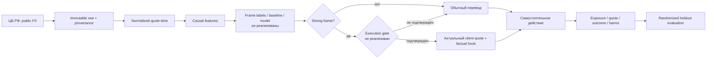

# Описание проекта — contextual quote

> Единое актуальное описание проекта после продуктового pivot. Продуктовая часть опирается на `docs_resync_2/product_pack` из коммита [`0d27cf9`](https://github.com/Konscig/team-2-aitalenthack/commit/0d27cf958b3f99f457528a8dd35cb96b65668212); технический статус сверяется с текущей веткой `main` и доступными Git-артефактами. Планы и гипотезы не выдаются за реализованный функционал или подтверждённый эффект.

| Поле | Значение |
| --- | --- |
| Название | Contextual quote для трансграничного перевода RUB → AMD/KGS/KZT/TJS/UZS |
| Стадия | Исследовательский прототип после продуктового pivot |
| Основной пользователь | Отправитель RUB в Армению, Кыргызстан, Казахстан, Таджикистан или Узбекистан |
| Основная проблема | Публичное движение курса само по себе не даёт человеку честного основания действовать: оно не равно исполнимым условиям и может превратиться в давление или ложное обещание |
| Основной сценарий | `strong market frame → execution gate → актуальный client quote + короткий factual hook → самостоятельное решение клиента` |
| Текущий статус | Data/feature pipeline и EDA готовы; legacy Web PoC существует в отдельной ветке/коммите; labels, модели, backtest, execution gate и целевой contextual-quote UI не реализованы |
| Главный стоппер | Неизвестно, сохраняется ли ценность public market frame в реальном client quote после spread, ликвидности, маршрутизации, hedge cost и операционных лимитов |
| Ближайшая контрольная точка | Зафиксировать label/`available_at`, построить walk-forward frame layer и получить контракт данных для execution gate |
| Дата актуализации | 4 сентября 2026 года |

## 1. Executive summary

Проект создаёт безопасное дополнение к обычному банковскому пути трансграничного перевода. Он не отвечает клиенту на вопрос «когда выгоднее переводить», не предсказывает курс и не советует ждать. Если рыночный слой обнаружил редкий сильный frame и реальные условия исполнения не противоречат ему, рядом с актуальным исполнимым quote может появиться короткий factual hook — проверяемый факт о текущем или прошлом состоянии рынка. Клиент сам решает, продолжать ли перевод.

Обычный путь `Перевести сейчас` доступен всегда и остаётся главным. Если frame слабый, пограничный, не подтверждён исполнением или данные недоступны, дополнительный hook не показывается. Клиенту не демонстрируется состояние «плохой момент».

Фактически реализован воспроизводимый data/analytics-контур на официальных данных Банка России: immutable raw snapshot, provenance, нормализация, quote-time и calendar-time, base/advanced features и выполненный EDA. В текущем `main` нет labels, baseline, обученной модели, backtest, execution gate, frontend или API.

В истории репозитория существует legacy Web PoC: FastAPI, статический mobile-width UI, OpenAPI и in-memory demo endpoints. Он относится к предыдущей гипотезе `signal → push → status → transfer`, использует синтетические UI-fixtures и не подключён к data/ML или платёжному контуру. Согласно `docs_resync_2/product_pack/02-mvp-and-scenario.md@0d27cf9`, этот PoC имеет статус **«в переработке под contextual quote»** и не является интерфейсом текущего MVP.

Главная незакрытая проверка лежит между market analytics и продуктом: сильный frame по публичному ряду может исчезнуть после учёта реального spread, доступной ликвидности, маршрута, стоимости хеджирования и операционных ограничений. До появления execution gate factual hook остаётся продуктовой гипотезой.

## 2. Источники истины и приоритет документов

| Область | Приоритетный источник | Как трактуется |
| --- | --- | --- |
| Текущая продуктовая концепция | `docs_resync_2/product_pack/01-product-brief.md@0d27cf9` | Определяет пользователя, проблему, продуктовую гипотезу и ценность |
| MVP и пользовательский сценарий | `docs_resync_2/product_pack/02-mvp-and-scenario.md@0d27cf9` | Определяет границы contextual quote и статус legacy PoC |
| Проверка, риски и AI Product | `docs_resync_2/product_pack/03-validation-and-ai-product.md@0d27cf9` | Определяет execution stopper, порядок проверки и причинную оценку |
| Навигация по пакету | `docs_resync_2/product_pack/README.md@0d27cf9` | Фиксирует пакет как компактный набор текущей итерации |
| Техническая реализация данных | `src/`, `tests/`, `reports/`, `docs/dataset_card.md` в текущем `main` | Определяет фактически работающий data/feature pipeline |
| Legacy Web PoC | `app.py`, `static/`, `tests/test_web_poc.py` в `origin/001-web-transfer-prototype` и коммите `0d27cf9` | Реальный demo-код предыдущей продуктовой гипотезы, не текущий MVP |
| Старые продуктовые детали | `docs/CONTEXT_PACK.md`, `docs/BRIEF.md`, `docs/USER_STORY_MAP.md` | Используются как background только там, где не противоречат product pack |

Если старые push-centric документы расходятся с product pack, актуальной считается механика contextual quote. Старые численные пороги остаются экспериментальными ориентирами data/ML, но не доказанными критериями ценности продукта.

## 3. Пользователь, контексты операции и проблема

### Основной пользователь

Отправитель RUB, которому нужно выполнить трансграничный перевод в одну из пяти стран. Product pack не ограничивает пользователя биографией, миграционным статусом или семейной целью: такие характеристики требуют отдельного исследования.

У одной и той же операции возможны два контекста:

- **перевод с допустимым окном** — человек способен выбрать момент, но не хочет постоянно следить за курсами и интерпретировать графики;
- **критичный перевод** — деньги нужно отправить сразу, поэтому дополнительный контекст не должен тормозить, оценивать или ставить под сомнение действие.

### Проблема

Нехватка alert сама по себе не является основной проблемой. Публичный курс:

- не равен клиентскому execution quote;
- не учитывает spread, комиссии, ликвидность, маршрут и hedge cost;
- не доказывает точную выгоду или сумму к получению;
- легко превращается в прогноз, давление или совет ждать;
- не создаёт бесшовного действия внутри привычной формы перевода.

Задача продукта — не сообщить о графике, а дать человеку редкую, честную и необязательную причину проверить **реальные текущие условия** прямо в форме перевода.

## 4. Продуктовый pivot

### Было: signal/push-centric концепция

Предыдущая версия исходила из цепочки `найти выгодный момент → отправить push → проверить статус → открыть перевод`. В legacy PoC есть сценарии `current/changed/unknown`, ручные `ModelScenario` и demo push inbox.

У подхода три принципиальных ограничения:

1. публичный рыночный сигнал не гарантирует клиентские условия;
2. уведомление может создавать давление или мешать срочному сценарию;
3. CTR или открытие push не доказывают ценность перевода.

### Стало: contextual quote

Новая ставка:

```text
редкий strong market frame
        ↓
execution gate на реальном client quote
        ↓
актуальные суммы списания и получения
        ↓
короткий factual hook рядом с quote
        ↓
клиент сам переводит или закрывает форму
        ↓
outcome и harms оцениваются через holdout
```

Модель — не продукт, а техническое основание для допуска дополнительного контекста. Основная ценность находится в связке `frame → исполнимый quote → factual hook → outcome`, а не в публичных данных, графике или push самих по себе.

Push может быть будущим каналом входа, но не является ядром новой механики. Demo push/status-экраны legacy PoC не считаются интерфейсом MVP и должны быть переработаны.

## 5. Ценностное предложение и отличие от альтернатив

Продукт не просит пользователя постоянно мониторить курс, самостоятельно задавать порог или заранее делегировать системе момент сделки. Банк потенциально может показать редкий contextual hook непосредственно рядом с актуальным client quote и сразу оставить доступным привычный перевод.

| Альтернатива | Что уже решает | Отличие contextual quote |
| --- | --- | --- |
| Самостоятельный мониторинг | Пользователь смотрит графики и новости | Продукт сам отбирает редкий frame, но не принимает решение за клиента |
| PayOgo, Wise, XE | Графики, alerts и пользовательские пороги | Alert ещё не является актуальным quote конкретного перевода |
| Western Union, Revolut, KoronaPay | Расчёт и исполнение уже начатого перевода | Contextual quote добавляет проверенный повод рассмотреть действие в текущей форме |
| OFX и автоматизация по цели | Сделка при заранее заданном условии | Клиент сохраняет момент собственного решения; автоматического перевода нет |

Потенциальное преимущество станет трудно копируемым только после накопления собственного неперсонального контура по коридорам: какой frame прошёл execution gate, какой quote был доступен, какой hook показан и какой outcome/harm последовал. Сейчас это **гипотеза преимущества**, а не доказанный moat.

## 6. Продуктовая гипотеза и реестр проверок

Служебные ID `CQ-*` введены только для прослеживаемости этого документа; исходный product pack не назначает всем положениям формальные номера.

### 6.1. Главная гипотеза

> Когда market layer обнаруживает редкий strong frame, а реальные условия исполнения его не опровергают, короткий factual hook рядом с актуальным quote даёт клиенту понятное основание проверить перевод сейчас. Это повышает шанс осмысленного действия без прогноза курса, гарантии выгоды или совета ждать.

| ID | Гипотеза | Механизм | Критерий | Статус | Проверка | Источник |
| --- | --- | --- | --- | --- | --- | --- |
| CQ-CORE | Strong frame + execution-confirmed quote + factual hook создают осмысленное действие | Контекст показывается только после двух gate | Положительный incremental effect без ухудшения исполнения и harms | Гипотеза | Frame backtest → execution validation → UX → randomized holdout | `01-product-brief.md`, `03-validation-and-ai-product.md` |

### 6.2. Поддерживающие гипотезы

| ID | Гипотеза | Метрика/наблюдение | Статус | Kill criterion |
| --- | --- | --- | --- | --- |
| CQ-FRAME | На данных, доступных на T, можно редко находить strong frames лучше случайного дня | lift, b.p. outcome, частота, clustering, OOT stability | Гипотеза | Нет устойчивого преимущества над baseline |
| CQ-EXEC | Public frame сохраняется в client quote после spread, liquidity, routing и hedge cost | client quote vs baseline; spread; отказ/переоценка | Заблокировано | Quote противоречит frame или ухудшается неприемлемо |
| CQ-FORM | Hook рядом с quote воспринимается как контекст, а не прогноз/совет | корректный пересказ, perceived pressure, completion | Гипотеза | Пользователь видит гарантию, совет ждать или ложную экономию |
| CQ-SAFE | Обычный путь не ухудшается, особенно для критичной операции | completion, early exit, time-to-complete | Гипотеза | Ухудшение completion или рост ранних выходов |
| CQ-SILENCE | При weak/borderline/unconfirmed frame отсутствие hook безопаснее оценки момента | harms, complaints, opt-out, обычный completion | Продуктовое правило для MVP | Интерфейс начинает показывать «плохой момент» или мешать переводу |
| CQ-CAUSAL | Hook создаёт incremental transfers/net volume, а не перехватывает готовое намерение | treatment−holdout по completed transfers и net volume | Гипотеза | Эффект есть только в CTR или исчезает в holdout |
| CQ-LIQUIDITY | Кампания не уничтожает собственную ценность концентрацией спроса | spread/liquidity по коридору, reprice/refusal | Гипотеза | Спрос расширяет spread или исчерпывает ликвидность |
| CQ-WORDING | Одна–две строки factual wording достаточны и безопасны | comprehension, pressure, complaints | Гипотеза | Для понимания требуется прогноз/обещание или длинное объяснение |

### 6.3. Что больше не является актуальным продуктовым доказательством

- наличие push и открытие уведомления;
- legacy-статусы `current/changed/unknown` сами по себе;
- demo-сценарий `favorable_now` или `better_later`;
- высокий CTR без изменения completed transfers/net volume;
- сильный frame только на публичном курсе ЦБ;
- точная «выгода» без реального client quote;
- история календарного ряда или красивый график без execution gate.

## 7. Границы MVP

| Входит в целевой MVP | Не входит в целевой MVP |
| --- | --- |
| Пять RUB-коридоров: AMD, KGS, KZT, TJS, UZS | Прогноз курса и совет ждать |
| Обычная форма перевода с актуальным исполнимым quote | Гарантия курса или обещание экономии |
| Factual hook только при `strong frame + execution gate` | Hook при weak/borderline/unconfirmed frame |
| Обычный путь как главное действие при любом состоянии | Оценка «плохого момента» |
| Логирование frame, quote, hook, exposure, outcome и harms | Автоматический или реальный платёж в исследовательском PoC |
| Randomized holdout и safety guardrails | Rollout без контроля spread, liquidity и вреда |

Персонализация по истории переводов, автоматический перевод, фиксация курса, реальная push-доставка и production payment integration в текущий MVP не входят.

## 8. Основной пользовательский сценарий

### Strong frame подтверждён исполнением

1. Market layer на срезе T помечает frame как `strong`.
2. Execution gate проверяет client quote, spread, ликвидность, маршрут и операционные ограничения.
3. Пользователь открывает привычную форму и видит актуальные суммы списания и получения.
4. Рядом с quote отображается factual hook о прошлом/текущем контексте.
5. `Перевести сейчас` остаётся основным действием.
6. Пользователь может продолжить или закрыть форму; оба outcome логируются без оценки решения.

### Любое другое состояние

Показывается только обычная форма с актуальным quote. Нет второй кнопки, предупреждения, текста «невыгодно» или совета вернуться позже. Для критичного перевода это обязательный безопасный путь.

### Требования к factual hook

- одна–две строки;
- только проверяемый факт о прошлом или настоящем;
- никакого forecast, guarantee, exact saving или financial advice;
- не подменяет quote и не скрывает его условия;
- не снижает приоритет `Перевести сейчас`;
- проходит UX/content/compliance review до пилота.

## 9. Архитектура решения



| Слой | Фактическая реализация | Статус |
| --- | --- | --- |
| Public market ingestion | CBR SOAP, retry/backoff/cache, raw XML, request JSON, manifest, SHA-256 | Проверено в `main` |
| Normalization | RUB за 1 единицу валюты, quote-time/calendar-time | Проверено в `main` |
| Market features | Base, reversal, cross-currency, broad RUB, freshness | Проверено в `main` |
| Frame labels | Отдельные future targets | Не реализовано |
| Baseline/ML | Transparent rules, ML-Min/ML-Max | Не реализовано |
| Walk-forward/backtest | Temporal split, purge/embargo, signal table | Не реализовано |
| Execution gate | Client quote, spread, liquidity, routing, hedge/ops constraints | Заблокировано банковскими данными и контрактом |
| Целевой UI | Обычный quote + optional factual hook | Не реализовано |
| Legacy Web PoC | FastAPI + vanilla JS + in-memory fixtures | Реализован вне `main`, в переработке |
| Pilot instrumentation | Exposure, quote, hook, outcome, harms, holdout | Не реализовано |
| Production integration | Auth, real push/payment, persistence, monitoring, deployment | Не реализовано |

## 10. Реальный статус Web PoC и API

### Что действительно существует

В `origin/001-web-transfer-prototype` и коммите `0d27cf9` есть:

- `app.py` с FastAPI;
- `static/index.html`, `static/app.js`, `static/styles.css`;
- OpenAPI-контракт и Swagger;
- endpoints для health, corridors, demo signals, demo pushes, preferences, quotes и simulated transfers;
- in-memory storage и тесты API/UI-контрактов.

### Почему это не текущий MVP

- приложение отсутствует в рабочем дереве `main`;
- `DEMO_RATES_RUB` и model scenarios заданы синтетическими константами;
- API не читает feature Parquet и не выполняет model inference;
- `model_assessment_fixture` — fixture, а не модель;
- quote не является банковским execution quote;
- push не отправляется во внешний канал;
- переводы не исполняются, данные очищаются при рестарте;
- нет auth, database, bank API, observability или deployment;
- UI реализует предыдущую push/status-гипотезу, а не `strong frame + execution gate + contextual quote`.

В product pack зафиксировано решение переписать PoC. Его полезно переиспользовать как технический shell формы и API-тестов, но не как доказательство продуктовой готовности.

## 11. Данные и feature engineering

### Источник и направление

Production market source — официальный SOAP web-service Банка России `DailyInfo`: `https://www.cbr.ru/DailyInfoWebServ/DailyInfo.asmx`. Справочник валют получается динамически через `EnumValutesXML`, история — через `GetCursDynamicXML`.

```text
unit_rate = RUB за 1 единицу валюты получателя
```

При фиксированном RUB-бюджете меньшее значение выгоднее отправителю. Это аналитическая reference price, не execution quote банка.

### Snapshot

- запрошено: `2019-01-01`–`2026-09-03`;
- фактически: `2019-01-10`–`2026-09-03`;
- валюты: AMD, KGS, KZT, TJS, UZS, USD, EUR, CNY;
- 1 889 реальных observations на валюту;
- 15 112 quote-time строк;
- 22 352 calendar-time строки, из них 7 240 forward-filled;
- 9 445 строк × 104 поля в advanced quote-time feature table;
- 13 970 строк × 107 полей в calendar feature table.

| Артефакт | Назначение | Статус |
| --- | --- | --- |
| `data/raw/cbr/2019-01-01_2026-09-03/` | Неизменённые SOAP responses, requests и manifest | Проверено |
| `data/interim/cbr_fx_normalized.parquet` | Нормализованные реальные observations | Проверено |
| `data/interim/fx_quote_time.parquet` | Канонический quote-time | Проверено |
| `data/interim/fx_calendar_time.parquet` | Causal calendar expansion | Проверено |
| `data/features/base_market_features.parquet` | 64 base features + keys/rate | Проверено |
| `data/features/fx_features_daily.parquet` | Advanced quote-time; имя `daily` историческое | Проверено |
| `data/features/fx_features_calendar_daily.parquet` | Calendar-expanded advanced features | Проверено |

### Feature families

Returns/log returns, trailing SMA и расстояния, rolling extrema, past-only percentiles/favourability, momentum/streaks, volatility/range, reversal, implied recipient/USD, broad RUB по USD/EUR/CNY, corridor-specific returns и freshness.

Все признаки на T используют только информацию `<=T`. Percentile исключает текущую строку, z-score использует только предыдущие 60 наблюдений, centered windows/backfill/global scaling отсутствуют. Causality checks пройдены для 20 base и 30 advanced пар.

### Data gaps, критичные для продукта

В market dataset отсутствуют client quote, spread, комиссия, route, liquidity, hedge cost, operational limits, exposure/hook/outcome, клиентское намерение и harms. Поэтому текущий датасет способен питать frame layer, но не execution gate и не causal product evaluation.

## 12. Data/ML pipeline

| Этап | Результат | Статус |
| --- | --- | --- |
| Source discovery | 8 валют найдены, 3 USD values сверены с public page | Проверено |
| Raw ingestion | Retry/backoff/cache/provenance/checksums | Проверено |
| Normalization | Quote-time и calendar-time | Проверено |
| Base features | 5 коридоров, causal rolling features | Проверено |
| Advanced features | Reversal и cross-currency context | Проверено |
| EDA | Missingness, outliers, redundancy, regimes | Подготовлено |
| DQ closure | 224 экстремальные строки, duplicate policy, `available_at` | Запланировано |
| Labels | Future targets отдельно от features | Не реализовано |
| Temporal split | Walk-forward + purge/embargo | Не реализовано |
| Rule baseline | Сравнение с random day | Не реализовано |
| Candidate ML | ML-Min, затем условный ML-Max | Не реализовано |
| Frame policy | `strong/no frame`, threshold, frequency cap | Не реализовано |
| Execution gate | Market frame vs real client conditions | Заблокировано |
| Contextual UI | Quote + optional hook | Не реализовано |
| Pilot evaluation | Eligible treatment/holdout | Не реализовано |

## 13. Модели и сигнальная логика

Labels, baseline, model artifacts, fit/predict pipeline и backtest в текущем проекте отсутствуют. Наличие `baseline` как имени DataFrame в feature code или `ModelScenario` в legacy app не означает наличие baseline-модели или ML.

Целевой порядок эксперимента:

1. Pre-register label, знак, horizons, calendar semantics и `available_at`.
2. Сформировать random-day reference и прозрачный rules baseline.
3. Проверить ML-Min на собственном ряду коридора.
4. Допускать ML-Max только при устойчивом OOT gain и ablation evidence.
5. Отдельно калибровать threshold `strong/no frame` и frequency cap.
6. Перед показом hook всегда применять execution gate.

Future values допустимы только в labels/evaluation. Split должен быть временным; preprocessing fit только на train; purge/embargo — не меньше максимального label horizon.

Ошибка frame model не равна обычной classification error. False positive способен привести к нечестному hook, росту спроса в одном коридоре, ухудшению spread и потере доверия. False negative лишь не показывает дополнительный контекст: ordinary transfer продолжает работать.

## 14. Результаты, которые действительно подтверждены

| Результат | Факт | Что подтверждает | Чего не подтверждает |
| --- | --- | --- | --- |
| Source validation | 8/8 валют, 3/3 ручных USD совпадения | Корректность источника | Execution price |
| Raw snapshot | 15 112 строк, более 7,5 лет | Историческую базу | Качество frame |
| Data tests | 35 тестов `main` проходят | Текущие data/feature invariants | Web PoC и product effect |
| Causality | 20 base + 30 advanced checks PASS | Отсутствие очевидного future leakage в features | Labels/split, которых нет |
| EDA | 9 445 × 104, 0 duplicates, 0 unexpected mature NaN | Готовность к label design | Predictive power |
| Extremes | 224 строки оставлены на raw review | Аномалии не скрыты | Их окончательную валидность |
| Redundancy | 4 exact duplicate пары, 70 пар `abs(corr)>0,995` | Необходимость temporal ablation | Что удаление повысит качество |
| Legacy Web PoC | FastAPI/static/API/test source существует вне `main` | Техническую осуществимость demo shell | Contextual-quote MVP и production integration |

Связанный `docs_resync_2/PROJECT_DESCRIPTION.md@0d27cf9` сообщает о 42 прошедших тестах в объединённом состоянии data pipeline + legacy PoC. В текущем окружении независимо подтверждены 35 тестов `main`; 7 Web PoC tests не перезапускались из-за отсутствия FastAPI в установленном окружении. Поэтому 42 — зафиксированный результат source-commit, а не повторная проверка этого документа.

## 15. Метрики и критерии успеха

| Уровень | Критерий | Текущая доступность |
| --- | --- | --- |
| Понимание | Пользователь верно объясняет: hook — context, не прогноз или совет | Нет UX-теста |
| Безопасность пути | Ordinary transfer доступен всегда; критичный completion не ухудшается | Нет целевого UI/пилота |
| Frame quality | Walk-forward лучше random day по lift/b.p. outcome при контроле frequency/clustering/OOT | Нет labels/backtest |
| Execution | Client quote не хуже baseline; нет неприемлемого роста spread, отказов или repricing | Нет банковских данных/gate |
| Product effect | Положительная разница treatment−holdout в completed transfers и net volume | Нет pilot data |
| Harms | Opt-out, early exit, complaints, execution errors не выходят за stop criteria | Thresholds не согласованы |
| CTR | Диагностическая метрика | Не является критерием ценности |

Старый ориентир lift ≥1,3 может использоваться как кандидат для frame research, но новый product pack формулирует критерий качественно — выше random day и устойчиво во времени. Числовой go/no-go должен быть явно утверждён до backtest. Аналогично, старый ориентир `+5% volume/client` не подтверждён product pack и не является текущим обязательством.

Randomized holdout должен формироваться среди **одинаково eligible strong frames**. Иначе эффект hook будет смешан с уже существующим намерением выполнить перевод.

## 16. NFR и guardrails текущей концепции

| Категория | Требование | Статус |
| --- | --- | --- |
| Honesty | Public frame не выдаётся за execution quote | Принято, gate не реализован |
| Safe degradation | Нет подтверждения → нет hook, ordinary transfer работает | Принято, UI не реализован |
| Urgency | Критичный transfer никогда не ждёт сигнала | Принято |
| Causality | Causal features, separate labels, temporal evaluation | Features готовы; остальное нет |
| Frequency | Редкий hook и cap по коридору/политике | Порог не выбран |
| Execution safety | Spread/liquidity/reprice/refusal monitoring | Заблокировано |
| Communication | Только factual wording, без forecast/guarantee/advice | Требует content/compliance review |
| Auditability | Логировать frame, quote, hook, exposure, outcome и harms | Не реализовано |
| Privacy | Нет ПДн в исследовательском контуре | Выполнено для текущих данных/PoC |
| Reliability | Hook можно немедленно отключить по gate/stop criterion | Не реализовано |
| Production SLO | Latency, availability, RTO/RPO, load, quiet hours | Не определены |

## 17. Текущий прогресс

### Реализовано и проверено

- официальный CBR ingestion и provenance;
- normalization, quote-time/calendar-time;
- base/advanced/calendar features;
- causal checks и EDA;
- продуктовый pivot и компактный current product pack;
- legacy Web PoC как отдельный технический артефакт.

### Подготовлено концептуально

- contextual-quote problem statement;
- границы MVP;
- strong frame + execution gate policy;
- UX/pilot критерии;
- схема causal holdout;
- guardrails и kill criteria.

### Не реализовано

- labels, rules baseline, ML-Min/ML-Max;
- walk-forward/backtest и signals-on-T;
- execution/liquidity gate;
- factual hook rulebook и согласованный wording;
- новый contextual-quote UI/API;
- pilot logging, holdout и monitoring;
- production integration.

| Направление | Готовность | Вердикт |
| --- | --- | --- |
| Product concept | Обновлённый compact pack | Подготовлено |
| Product evidence | Нет real UX/pilot/execution evidence | Не подтверждено |
| Data | Полный snapshot и provenance | Проверено |
| Features | Causal base/advanced tables | Проверено |
| Frame model | Только hypothesis/inputs | Не подтверждено |
| Execution gate | Нет contract/data | Заблокировано |
| Legacy demo | Код существует вне main | Реализовано, в переработке |
| Target MVP | Нет contextual-quote screen | Не подтверждено |
| Pilot | Нет instrumented integration | Не подтверждено |
| Production | Нет architecture/deployment/SLO | Не готово |

## 18. План до финальной версии

| Приоритет | Работа | Definition of Done | Зависимость | Статус |
| --- | --- | --- | --- | --- |
| P0 | Закрыть DQ | 224 extremes проверены по raw; duplicate allowlist; `available_at` зафиксирован | CBR snapshot | Запланировано |
| P0 | Определить label contract | Формула, знак, horizons, calendar base, tail policy и random baseline pre-registered | Product/ML decision | Запланировано |
| P0 | Построить frame layer | Temporal labels, purge/embargo, rules baseline, candidate models, OOT report | Label contract | Запланировано |
| P0 | Получить execution contract | Поля client quote/spread/liquidity/route/hedge/limits и правила freshness | Кейсхолдер/банк | Заблокировано |
| P1 | Определить product policy | Versioned `strong/no frame`, frequency cap, silence и kill rules | Frame report + execution contract | Запланировано |
| P1 | Подготовить factual wording | Allowlist/denylist, основания frame, compliance review | Product policy | Запланировано |
| P1 | Переписать Web PoC | Ordinary quote — главный экран; hook только после двух gate; legacy statuses убраны | Policy + quote fixtures/contract | Запланировано |
| P1 | Провести concept/UX test | Strong/weak/critical scenarios, comprehension и pressure protocol | Target PoC | Запланировано |
| P2 | Спроектировать pilot | Exposure/quote/hook/outcome/harms, eligible holdout, stop criteria | Execution/UI integration | Запланировано |
| P2 | Production readiness | Auth, persistence, monitoring, deployment, legal, SLO | Успешный pilot | Не подтверждено |

## 19. Основные риски и открытые вопросы

| Риск/вопрос | Влияние | Контроль/следующий шаг |
| --- | --- | --- |
| Public frame не переживает execution | Критическое | Execution gate; если не проходит — hook запрещён |
| Кампания ухудшает spread/liquidity | Критическое | Frequency cap, corridor monitoring, stop criterion |
| Не определён `available_at` | Leakage на T | Зафиксировать publication lag до label/model |
| Label выбирается post-hoc | Ложный lift | Pre-register contract до просмотра results |
| Legacy UI воспринимается как target MVP | Ошибка scope | Явно пометить PoC как «в переработке» |
| Синтетический demo quote выглядит реальным | Репутационный/комплаенс-риск | Не использовать как product evidence; явная маркировка |
| Hook давит на срочного пользователя | Потеря completion/trust | Ordinary path first; critical UX test |
| CTR подменяет causality | Ложный product effect | Eligible randomized holdout, completed/net volume |
| Нет client/operations data | Блокирует execution и pilot | Согласовать contract и legal access |
| Structural drift рынка | Нестабильный frame | Walk-forward/OOT и corridor-level monitoring |
| 224 экстремальные строки | Ошибка модели | Raw verification без silent deletion |
| Feature redundancy | Overfit/нестабильность | Train-only selection и OOT ablation |
| Wording не согласован | Комплаенс-риск | Expert review и kill criteria |
| Нет production NFR | Нельзя планировать rollout | Constraint-loop после pilot decision |

## 20. Решения и допущения

| Решение | Статус | Основание |
| --- | --- | --- |
| Продукт — contextual quote, а не прогноз момента | Принято | Product pack `0d27cf9` |
| Hook требует одновременно strong frame и execution confirmation | Принято | Product brief/MVP/validation |
| Нет strong/confirmed frame → только ordinary transfer | Принято | MVP scenario |
| Для клиента не существует «плохого момента» | Принято | No-pressure/safe path |
| Client quote важнее public reference | Принято | Execution stopper |
| CTR — только diagnostic | Принято | Causal holdout design |
| Legacy push/status UI не является MVP | Принято | `02-mvp-and-scenario.md` |
| CBR rate — RUB за recipient unit; lower лучше отправителю | Проверено для market layer | Data pipeline docs |
| Calendar fill не является новым market event | Реализовано | `is_new_quote=False` |
| Семейный/миграционный framing не универсален | Не подтверждено | Product pack определяет пользователя по операции, не биографии |
| Execution gate может полностью остановить продуктовую механику | Принято | Главный stop criterion |

## 21. Карта артефактов и веток

```text
main
├── data/                         # raw/reference/interim/features
├── src/                          # ingestion/normalization/features
├── tests/                        # 35 data/feature tests
├── reports/                      # stage reports и EDA
├── notebooks/                    # выполненный EDA
├── docs/                         # прежняя product/data документация
├── description.md               # описание до product-pack resync
└── description_2.md             # это описание после pivot

commit 0d27cf9
└── docs_resync_2/product_pack/
    ├── README.md
    ├── 01-product-brief.md
    ├── 02-mvp-and-scenario.md
    └── 03-validation-and-ai-product.md

origin/001-web-transfer-prototype / commit 0d27cf9
├── app.py
├── static/
├── specs/001-web-transfer-prototype/
└── tests/test_web_poc.py
```

Product pack и legacy PoC сейчас не находятся в рабочем дереве `main`. Нельзя описывать их как доступные после обычного запуска текущей ветки без merge/cherry-pick или переключения на соответствующий ref.

## 22. Воспроизведение подтверждённого data-состояния

```powershell
python -m pip install numpy==2.2.6 pandas==3.0.5 pyarrow==25.0.1 tabulate==0.9.0 pytest
python -m pytest tests -q -p no:cacheprovider
python -m src.normalization --raw-dir data/raw/cbr --output-dir data/interim
python -m src.features.base_features
python -m src.features.advanced_features
python -m src.features.calendar_features
```

В текущем `main` нет команды для labels, model training, backtest, execution gate, contextual UI или production deployment.

Legacy Web PoC имеет отдельный documented запуск `python -m uvicorn app:app --reload`, но требует ref, содержащий `app.py/static`, и установленные FastAPI/Uvicorn. Этот запуск демонстрирует только синтетический предыдущий сценарий.

## 23. Итоговая готовность

| Цель | Вердикт |
| --- | --- |
| Воспроизводимые public market data | **PASS** |
| Causal market features и EDA | **PASS** |
| Strong frame model | **FAIL / не выполнено** |
| Execution gate | **BLOCKED** |
| Legacy demo shell | **Есть вне `main`, требует переработки** |
| Contextual-quote MVP | **Не реализован** |
| Product value | **Не подтверждена** |
| Pilot | **Не готов** |
| Production | **Не готов** |

Текущий честный статус: команда доказала техническую готовность market-data основы, но не доказала strong frame, перенос frame в execution quote или влияние factual hook на переводы. Главный следующий продуктовый шаг — не улучшение push, а проверка execution contract и сбор contextual-quote MVP вокруг обычной формы перевода.

## Приложение A. Что изменилось относительно `description.md`

| Тема | Прежняя трактовка | Актуальная трактовка product pack |
| --- | --- | --- |
| Продукт | Редкий сигнал и push о благоприятном моменте | Contextual quote рядом с реальным исполнимым quote |
| Главный gate | Сила market signal | `strong frame + execution gate` |
| Основное действие | Открыть push и перейти в перевод | Обычный перевод доступен всегда; hook необязателен |
| Weak/negative state | Молчание/push policy | В UI только обычный перевод, без оценки момента |
| Product metric | Открытие/start и будущий business uplift | Completed transfers/net volume в eligible holdout; CTR diagnostic |
| Ключевой риск | Stale/incorrect signal | Public frame не переживает execution; кампания ухудшает spread/liquidity |
| Web PoC | Не был учтён при первом аудите | Существует, но legacy и «в переработке» |
| Production blocker | Model/backtest | Также обязательны client quote contract и execution gate |

## Приложение B. Неподтверждённые утверждения

- что market layer способен устойчиво находить strong frames;
- что frame сохраняется в client quote после всех издержек;
- что factual hook понятен и не создаёт давления;
- что hook увеличивает completed transfers или net volume;
- что эффект не является переносом уже существующего намерения;
- что кампания не ухудшает spread/ликвидность;
- что legacy PoC можно использовать без переработки;
- что конкретный wording допустим юридически и комплаенсно;
- что старые пороги lift/frequency/business uplift подходят новой политике;
- что решение готово к pilot или production.

## Приложение C. Термины

| Термин | Значение |
| --- | --- |
| Market frame | Состояние публичного рыночного ряда, выделенное правилами/моделью на T |
| Strong frame | Frame, прошедший offline threshold и policy checks; точное правило ещё не задано |
| Client quote | Актуальные исполнимые условия конкретного перевода |
| Execution gate | Проверка, что client quote, spread, liquidity, routing и constraints не опровергают frame |
| Factual hook | Короткий факт о прошлом/настоящем рядом с quote, без прогноза и обещания |
| Contextual quote | Client quote с необязательным factual hook после двух gate |
| Ordinary transfer | Обычный путь без оценки момента, доступный всегда |
| Outcome | Фактическое действие: завершение, объём или отказ от перевода |
| Harms | Early exit, opt-out, complaint, reprice/refusal и другие негативные эффекты |
| Eligible holdout | Случайное сравнение hook/no-hook среди одинаково допустимых strong frames |
| Legacy Web PoC | Синтетический FastAPI/UI прототип предыдущей signal/push гипотезы |
