# User Journey Map — эластичный отправитель: «Выгодный момент для семейного перевода»

> **Персона:** Рустам — регулярный отправитель с потенциальным окном выбора даты.  
> **Цель:** вовремя поддержать близких и, когда срок допускает, выбрать более благоприятный момент без постоянного мониторинга курса.  
> **Основано на:** [Brief](BRIEF.md), [User Story Map](USER_STORY_MAP.md), [персоне Рустама](personas/rustam-elastic-sender.md), [повторном AI CustDev](interviews/AI_CUSTDEV_REINTERVIEW_SYNTHESIS.md).  
> **Статус оценок:** рабочие UX-допущения, а не результаты интервью или продуктовой аналитики. AI CustDev использован только для поиска рисков в пути.
> **Формат:** flowchart выбран вместо Mermaid Journey ради читаемости; шкала score сохранена в значении Journey Map.

> Парная карта: [неэластичный отправитель](INELASTIC_JOURNEY_MAP.md).

---

## Диаграмма

### Как читать оценки

Score показывает, насколько простым, понятным и безопасным **предположительно** будет конкретное действие для клиента в первой версии пути.

| Score | Значение | Как использовать |
| ---: | --- | --- |
| 1 | Критическая боль | Не выпускать без изменения сценария. |
| 2 | Серьёзное трение или риск недоверия | Главный предмет доработки и проверки. |
| 3 | Рабочий, но непроверенный опыт | Допущение, которое нужно подтвердить. |
| 4 | Понятный и контролируемый опыт | Сохраняем принцип, но проверяем в прототипе/пилоте. |
| 5 | Отличный подтверждённый опыт | В карте не используем: реальных данных пока нет. |

Это **не** оценка полезности гипотезы, не вероятность успеха, не NPS и не фактическая удовлетворённость клиентов. Красные блоки — точки с score 2; зелёные — score 4; жёлтые — score 3.

```mermaid
flowchart TD
    P1(["1. Контекст перевода"]):::phase
    A1["Получатель обозначает срок и цель<br/>Рустам оценивает допустимое окно<br/><b>Score 3/5</b>"]:::neutral

    P2(["2. Пуш — отдельный этап"]):::phase
    B1["Получает редкий пуш<br/>по знакомому направлению<br/><b>Score 4/5</b>"]:::good
    B2["Понимает направление и наблюдаемый факт<br/>Риск: текст могут принять за обещание<br/><b>Score 2/5</b>"]:::risk
    B3["Решает открыть пуш<br/>без ощущения давления<br/><b>Score 3/5</b>"]:::neutral

    P3(["3. После открытия"]):::phase
    C1["Видит статус: актуально / изменилось / неизвестно<br/>Риск: условия могли измениться<br/><b>Score 2/5</b>"]:::risk
    C2["Сам выбирает: перевести сейчас<br/>или вернуться позже<br/><b>Score 4/5</b>"]:::good

    P4(["4. Обычный перевод и результат"]):::phase
    D1["Переходит в привычный путь перевода<br/>Задана только страна; остальное выбирает сам<br/><b>Score 3/5</b>"]:::neutral
    D2["Проверяет текущие условия<br/>и завершает перевод<br/><b>Score 4/5</b>"]:::good

    P5(["5. Следующий цикл"]):::phase
    E1["Оценивает, стоил ли пуш доверия<br/><b>Score 3/5</b>"]:::neutral
    E2["Оставляет уведомления включёнными<br/>или отключает их<br/><b>Score 3/5</b>"]:::neutral

    P1 --> A1 --> P2 --> B1 --> B2 --> B3 --> P3 --> C1 --> C2 --> P4 --> D1 --> D2 --> P5 --> E1 --> E2

    classDef phase fill:#1D4ED8,stroke:#93C5FD,stroke-width:2px,color:#FFFFFF,font-weight:bold
    classDef good fill:#14532D,stroke:#86EFAC,stroke-width:2px,color:#FFFFFF
    classDef neutral fill:#78350F,stroke:#FCD34D,stroke-width:2px,color:#FFFFFF
    classDef risk fill:#7F1D1D,stroke:#FCA5A5,stroke-width:2px,color:#FFFFFF
```

---

## Анализ по фазам

### 1. Контекст и окно выбора

| Действие | Score | Почему такая оценка | Pain points |
| --- | ---: | --- | --- |
| Понимает цель и срок перевода | 3 | Рустам и получатель обычно могут договориться, но банк этого контекста не видит. | Срок и достаточность суммы зависят от конкретного перевода; семейный контекст нельзя превращать в допущение банка. |
| Решает, можно ли сдвинуть дату | 3 | Для регулярного перевода может быть короткое окно после зарплаты или до привычной даты. | Регулярность не равна эластичности; ожидание грозит забыванием, другой тратой или нарушением обещанного срока. |

**Что думает пользователь:** «Я помогу семье в любом случае; вопрос только в том, есть ли у меня сегодня право немного подождать».

### 2. Пуш: отдельный этап

| Действие | Score | Почему такая оценка | Pain points |
| --- | ---: | --- | --- |
| Получает редкий пуш по знакомому направлению | 4 | Банк снимает с клиента рутинный мониторинг и даёт повод вернуться до привычного входа в перевод. | Реальный частотный лимит суммарный на клиента; ориентир 1–2 сигнала в неделю на коридор — лишь самопроверка фильтра. |
| Понимает направление и наблюдаемый факт | 2 | Без формулы и точной выгоды текст обязан быть предельно однозначным. | «Валюта снижается» без направления RUB → страна/валюта получателя непонятна; «близкий получит больше» может восприниматься как давление. |
| Решает открыть пуш | 3 | Нейтральный факт и знакомый коридор могут вызвать интерес. | Повторные слабые или рекламные поводы быстро разрушают доверие; пуш не должен предсказывать курс или призывать «успеть». |

**Что думает пользователь:** «Почему мне написали именно сейчас и что это значит для моего перевода — без обещаний?»

### 3. После открытия

| Действие | Score | Почему такая оценка | Pain points |
| --- | ---: | --- | --- |
| Видит статус момента на сейчас | 2 | Разрыв между отправкой и открытием критичен: публичный ряд не равен курсу исполнения. | Нужны честные состояния `актуально / изменилось / неизвестно`; timestamp сам по себе не доказывает актуальность. |
| Выбирает перевести сейчас или вернуться позже | 4 | Клиент сохраняет контроль: при срочности продолжает обычный перевод, при окне выбора решает сам. | Нельзя подталкивать к ожиданию и нельзя маркировать перевод как «невыгодный». |

**Что думает пользователь:** «Покажите честно, что известно сейчас; если деньги нужны — я всё равно должен суметь отправить их без задержки».

### 4. Обычный перевод и результат

| Действие | Score | Почему такая оценка | Pain points |
| --- | ---: | --- | --- |
| Переходит в подходящий путь перевода | 3 | Deep link к знакомому направлению потенциально сокращает путь. | В первой версии допустим только обратимый низкорисковый контекст: страна — базовый кандидат; способ требует проверки; получатель и сумма не предзаполняются. |
| Проверяет текущие условия и завершает перевод | 4 | Это привычная задача приложения, и клиент сам принимает окончательное решение. | Требуются экраны после корректного ввода суммы, чтобы проверить место показа итоговых условий и подтверждения. |

**Что думает пользователь:** «Не заставляйте меня разбираться с прошлым пушем — дайте увидеть текущие условия и закончить перевод».

### 5. Следующий цикл

| Действие | Score | Почему такая оценка | Pain points |
| --- | ---: | --- | --- |
| Оценивает, стоил ли пуш доверия | 3 | Редкий честный опыт может закрепить доверие к следующему сообщению. | Один устаревший или непонятный пуш способен обесценить канал; этого нельзя измерить до пилота. |
| Оставляет уведомления включёнными или отключает их | 3 | Решение зависит от точности, редкости и понятности прошлых сообщений. | Нет данных об opt-out и фактической реакции клиентов; эффект проверяется только пилотом с холдаутом. |

**Что думает пользователь:** «Если это опять был просто способ заманить меня в приложение, я такие уведомления выключу».

---

## Выявленные проблемы

### Критические (Score 1–2)

| Точка пути | Риск | Последствие для клиента и банка | Что нужно сделать |
| --- | --- | --- | --- |
| **Понимание пуша** | Динамика без явного направления RUB → страна/валюта получателя может быть непонятна или воспринята как обещание. | Пуш игнорируют, считают рекламой или отключают уведомления. | Проверить текст на пересказ: направление, факт, отсутствие прогноза. |
| **Открытие после пуша** | Нет основания всегда называть старый сигнал актуальным; реальные условия могли измениться. | Потеря доверия и уход в альтернативный сервис в момент намерения перевести. | Показать статус `актуально / изменилось / неизвестно`; при `неизвестно` дать нейтральный вход в обычный перевод. |

### Оставшийся gap в User Story Map

| # | Что отсутствует или требует уточнения | Где должно быть | Рекомендация |
| ---: | --- | --- | --- |
| 1 | Точка показа текущих итоговых условий и подтверждения | EPIC-006 / Gap Analysis | Дособрать скриншоты пути после корректного ввода суммы и сверить встроенный сценарий с реальным приложением. |

---

## Статус правок по итогам карты

### Приоритет 1 — критично

- [x] **EPIC-002 / US-004:** добавлен критерий семантической понятности пуша: направление перевода, факт и отсутствие прогноза пользователь может пересказать своими словами.
- [x] **EPIC-005 / SS-003:** зафиксированы состояния `актуально / изменилось / неизвестно` и нейтральный сценарий обычного перевода для `неизвестно`.

### Приоритет 2 — важно

- [x] **EPIC-003:** срочность и допустимое окно описаны как свойства конкретной операции, а не как неизменный тип клиента.
- [x] **EPIC-006 / US-012:** разделены нейтральный переход и персональное предзаполнение; в первой версии задаётся только страна.
- [ ] **Gap Analysis:** получить и разметить финальные экраны текущего пути перевода после ввода суммы.

### Приоритет 3 — улучшение

- [x] **EPIC-008:** в плане пилота зафиксированы холдаут, доверие, opt-out, ранние выходы, ошибки/возвраты и повторное использование; открытие пуша не считается доказательством ценности.

---

## Метрики карты

- **Средний score:** 3,1 / 5.
- **Критических точек (score ≤ 2):** 2.
- **Самые слабые фазы:** «Контекст и окно выбора», «Пуш: отдельный этап», «После открытия» и «Следующий цикл» — по 3,0 / 5; наиболее рискованная из них — «После открытия» из-за честности статуса момента.
- **Самая сильная фаза:** «Обычный перевод и результат» — 3,5 / 5; предполагается, что привычный путь перевода доступен без блокировки.

## Следующие шаги

1. [ ] Собрать финальные скриншоты перевода и проверить точку показа текущих условий и подтверждения.
2. [ ] Провести реальное интервью или тест текста/прототипа на понимание пуша и отсутствие давления.
3. [ ] После появления экранов и результатов теста пересмотреть scores Journey Map.
