# User Journey Map — неэластичный отправитель: «Срочный семейный перевод без давления»

> **Персона:** Мадина — отправитель, для которого срок критичен в конкретном переводе.  
> **Цель:** отправить деньги вовремя и без дополнительных сомнений, даже если пуш устарел или момент не является благоприятным.  
> **Основано на:** [Brief](BRIEF.md), [User Story Map](USER_STORY_MAP.md), [персоне Мадины](personas/madina-inelastic-sender.md), [повторном AI CustDev](interviews/AI_CUSTDEV_REINTERVIEW_URGENCY_RECEIVER.md).  
> **Статус оценок:** рабочие UX-допущения. Они не являются результатом реальных интервью или продуктовой аналитики.
> **Формат:** flowchart выбран вместо Mermaid Journey ради читаемости; шкала score сохранена в значении Journey Map.

> Парная карта: [эластичный отправитель](ELASTIC_JOURNEY_MAP.md).

---

## Как читать оценки

Score показывает предполагаемую простоту, понятность и безопасность действия для Мадины в первой версии пути.

| Score | Значение |
| ---: | --- |
| 1 | Сценарий создаёт вред или недопустимый барьер. |
| 2 | Сильное трение, которое нужно снять до пилота. |
| 3 | Рабочее, но непроверенное допущение. |
| 4 | Понятный и контролируемый опыт; сохраняем как принцип. |
| 5 | Подтверждённо отличный опыт; пока не используем без реальных данных. |

Score не измеряет удовлетворённость, конверсию или ценность для банка. Он нужен, чтобы расставить UX-приоритеты. Красный блок — риск, зелёный — защищённый принцип, жёлтый — зона проверки.

## Диаграмма

```mermaid
flowchart TD
    P1(["1. Возникает срочная потребность"]):::phase
    A1["Получает просьбу близкого<br/>и понимает срок перевода<br/><b>Score 3/5 — внешний constraint</b>"]:::neutral

    P2(["2. Начинает обычный перевод"]):::phase
    B1["Открывает привычный путь<br/>без необходимости объяснять срочность<br/><b>Score 4/5</b>"]:::good
    B2["Не получает пуш<br/>о неблагоприятном моменте<br/><b>Score 4/5</b>"]:::good

    P3(["3. Если пуш был открыт"]):::phase
    C1["Видит нейтральный статус момента<br/>без оценки её решения<br/><b>Score 3/5</b>"]:::neutral
    C2["Сразу продолжает обычный перевод<br/>без ожидания нового сигнала<br/><b>Score 4/5</b>"]:::good

    P4(["4. Завершает перевод"]):::phase
    D1["Проверяет получателя, сумму<br/>и текущие условия<br/><b>Score 3/5</b>"]:::neutral
    D2["Подтверждает перевод<br/>и получает понятный статус<br/><b>Score 4/5</b>"]:::good

    P5(["5. Подтверждает помощь"]):::phase
    E1["Получатель получает деньги<br/>или Мадина видит статус результата<br/><b>Score 3/5</b>"]:::neutral
    E2["Оценивает, не помешал ли банк<br/>выполнить обязательство<br/><b>Score 3/5</b>"]:::neutral

    P1 --> A1 --> P2 --> B1 --> B2 --> P3 --> C1 --> C2 --> P4 --> D1 --> D2 --> P5 --> E1 --> E2

    classDef phase fill:#1D4ED8,stroke:#93C5FD,stroke-width:2px,color:#FFFFFF,font-weight:bold
    classDef good fill:#14532D,stroke:#86EFAC,stroke-width:2px,color:#FFFFFF
    classDef neutral fill:#78350F,stroke:#FCD34D,stroke-width:2px,color:#FFFFFF
    classDef risk fill:#7F1D1D,stroke:#FCA5A5,stroke-width:2px,color:#FFFFFF
```

---

## Анализ по фазам

### 1. Срочность задаёт рамку пути

| Действие | Score | Почему такая оценка | Риск |
| --- | ---: | --- | --- |
| Получает просьбу и понимает срок | 3 | Это не продуктовая ошибка, а внешний constraint: ожидание может означать задержку помощи. | Нельзя интерпретировать срочность как повод убеждать ждать или искать лучший момент. |

**Что думает Мадина:** «Деньги нужны сейчас; мне важно не потерять время и не начать сомневаться».

### 2. Обычный перевод должен остаться главным маршрутом

| Действие | Score | Почему такая оценка | Риск |
| --- | ---: | --- | --- |
| Открывает привычный путь | 4 | Пользователь сохраняет знакомый способ действия и контроль. | Путь нельзя усложнять ради объяснения рынка. |
| Не получает отрицательный пуш | 4 | Выбранное правило первой версии защищает от чувства вины и поиска альтернативы. | Это продуктовое решение, а не доказанный эффект на доверие. |

**Что думает Мадина:** «Не оценивайте мой перевод как плохой — дайте просто отправить».

### 3. Устаревший пуш не должен создавать новый барьер

| Действие | Score | Почему такая оценка | Риск |
| --- | ---: | --- | --- |
| Видит нейтральный статус момента | 3 | Честность необходима, но конкретная механика ещё не протестирована. | Нельзя называть старый момент актуальным без основания. |
| Продолжает обычный перевод | 4 | Возможность действовать важнее объяснения динамики. | Нельзя требовать ожидания, сравнения или объяснения причины срочности. |

**Что думает Мадина:** «Можно сообщить, что ситуация изменилась, но не задерживайте меня новым выбором».

### 4. Контроль перед подтверждением

| Действие | Score | Почему такая оценка | Риск |
| --- | ---: | --- | --- |
| Проверяет данные и текущие условия | 3 | Окончательное решение остаётся у пользователя; точка показа итоговых условий ещё требует проверки на реальных экранах. | Ошибка в получателе или сумме опаснее лишнего шага; предзаполнение не должно убирать контроль. |
| Подтверждает перевод | 4 | Это привычная цель сценария, если путь не был нарушен. | Финальные экраны текущего приложения ещё нужно документировать. |

### 5. Завершение и доверие

| Действие | Score | Почему такая оценка | Риск |
| --- | ---: | --- | --- |
| Видит результат / получатель получает деньги | 3 | Критерий успеха — своевременность, но доступных данных о фактическом результате пока нет. | Не считать завершение операции доказательством ценности пуша. |
| Оценивает вмешательство банка | 3 | Опыт может повлиять на доверие к будущим сообщениям. | Реакцию, opt-out и повторные переводы можно измерить только пилотом. |

---

## Выявленные проблемы

| Точка пути | Риск | Последствие | Что нужно сделать |
| --- | --- | --- | --- |
| **Срочность перевода** | Продукт подталкивает ждать или оценивает момент как плохой. | Задержка помощи, чувство вины, уход в другой сервис. | Оставить молчание при пограничном/отрицательном моменте и обычный путь без барьера. |
| **Открытие устаревшего пуша** | Объяснение актуальности требует лишнего решения или скрывает изменение условий. | Пользователь теряет время и доверие. | Сначала нейтральный статус, затем равноправное действие «продолжить перевод». |
| **Предзаполнение** | Подставлены чувствительные или ошибочные поля. | Ошибка в получателе/сумме либо отказ от сценария. | В первой версии — только обратимый переход; получатель и сумма не подставляются. |

## Оставшийся gap в User Story Map

| Что требует уточнения | Где | Рекомендация |
| --- | --- | --- |
| Подтверждение результата в текущем приложении | EPIC-006 / Gap Analysis | Дособрать экраны после ввода суммы и подтверждения. |

## Статус правок по итогам карты

### Приоритет 1 — критично

- [x] **US-013:** добавлен критерий «срок критичен для этого перевода» и равноправный переход в обычный перевод без обязательного ожидания или сравнения.
- [x] **SS-003:** для состояния `неизвестно` не заявляется выгода и не блокируется действие.

### Приоритет 2 — важно

- [x] **US-012 / US-013:** предзаполнение зафиксировано только как обратимое сокращение пути к стране; способ, получатель и сумма не подставляются.
- [ ] **EPIC-006:** разметить финальные экраны пути перевода и точку показа текущих условий.

### Приоритет 3 — проверка пилотом

- [ ] **US-009 / US-018:** измерять opt-out, ранний выход, ошибки и повторные переводы через холдаут; не делать вывод о доверии по симуляции.

## Метрики карты

- **Средний score:** 3,3 / 5.
- **Критических точек (score ≤ 2):** 0; срочность отражена как внешний constraint, а не дефект интерфейса.
- **Самая уязвимая фаза:** «Если пуш был открыт» — 3,5 / 5 формально, но с наибольшим риском потери доверия при неверной механике.
- **Самая сильная фаза:** «Начинает обычный перевод» — 4,0 / 5 при соблюдении правила не отправлять отрицательный пуш.

## Следующие шаги

1. [ ] Согласовать, что базовый сценарий Мадины — обычный перевод, а не оптимизация дня.
2. [ ] Протестировать прототип состояния `изменилось / неизвестно` на участниках со срочными переводами.
3. [ ] После появления финальных экранов приложения обновить карту и USM.
