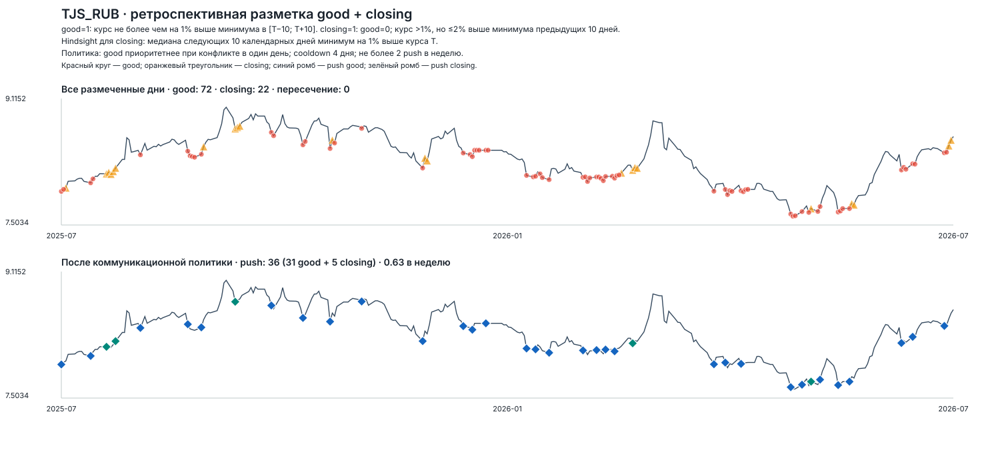
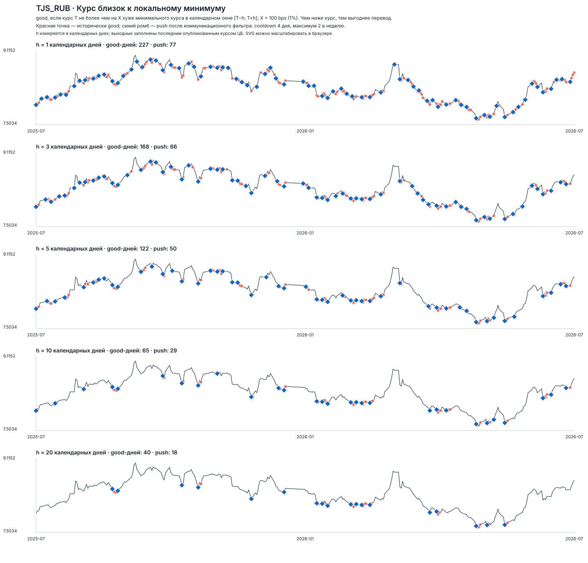
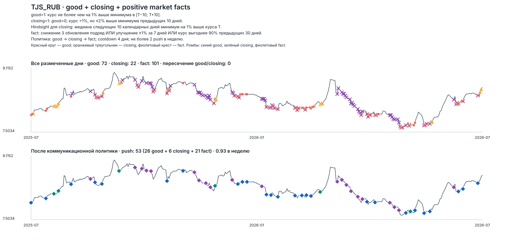

# Методология golden-разметки благоприятных дней

## Назначение

Golden dataset ретроспективно отвечает на два вопроса: был ли день `T`
благоприятным для перевода (`good`) и находился ли он непосредственно после
хорошего периода перед устойчивым ухудшением курса (`closing`).

Это не правило отправки push и не прогноз курса. Будущее используется только
для формирования эталонных меток; модель на дату `T` будущего не видит.

## Входные данные

- `data/features/fx_features_daily.parquet` — признаки, рассчитанные на реальных
  датах действия котировок ЦБ;
- `data/interim/fx_calendar_time.parquet` — календарный ряд, в котором последний
  действующий курс переносится на дни без новой котировки;
- коридоры: `AMD_RUB`, `KGS_RUB`, `KZT_RUB`, `TJS_RUB`, `UZS_RUB`;
- финальная разметка строится на всей общей доступной истории. Крайние `h`
  календарных дней автоматически исключаются, потому что для них невозможно
  построить полное симметричное окно.

Курс выражен в RUB за одну единицу валюты получателя. Чем он ниже, тем выгоднее
момент для отправителя.

## Календарь допустимых дней

Сначала признаки расширяются до календарных дат методом forward fill. Поэтому
курс, вступивший в силу в субботу, сохраняется в воскресенье и понедельник.
После этого суббота и воскресенье исключаются, а понедельник остаётся кандидатом
с последним действующим курсом и последним доступным состоянием признаков.

Итоговый dataset содержит только понедельник–пятницу. При переносе признаков
счётчики свежести широкого рынка пересчитываются в календарном времени.

## Определение `good`

Зафиксированы параметры:

- правило: `near_local_min`;
- горизонт: `h = 10` календарных дней;
- допустимое отклонение: `X = 100 bps = 1%`.

Для каждого допустимого дня `T` строится календарное окно:

```text
[T − 10 дней; T + 10 дней]
```

Пусть `rate_T` — курс в день `T`, а `min_rate` — минимальный курс в этом окне.
Метка определяется так:

```text
good = rate_T <= min_rate × (1 + 100 / 10 000)
```

Иными словами, `good = True`, если курс дня `T` не более чем на 1% хуже
локально лучшего курса за 21-дневное окно. Допуск позволяет размечать хорошим
всё низкое плато, а не только единственную точку абсолютного минимума.

## Определение `closing`

`closing = 1`, если одновременно выполняются условия:

1. `good = 0`;
2. курс в `T` более чем на 100, но не более чем на 200 bps выше минимального
   курса предыдущих 10 календарных дней;
3. медиана курса следующих 10 календарных дней минимум на 100 bps выше курса
   в `T`.

Второе условие означает, что курс уже вышел из зоны `good`, но остаётся недалеко
от недавнего минимума. Третье использует hindsight и требует не разового скачка,
а устойчивого последующего ухудшения на продуктово заметную величину.

Нижняя граница сделана строгой: отклонение до 100 bps уже относится к допустимой
погрешности `good`. Дополнительное условие `good = 0` гарантирует, что `good` и
`closing` не пересекаются.



## Обоснование параметров

`h = 10` выбран как консервативный продуктовый горизонт. Окно в 21 календарный
день сопоставимо с регулярностью нескольких переводов в месяц и снижает число
сомнительных локальных минимумов. Это согласуется с асимметрией ошибки из кейса:
ошибочный совет перевести дороже, чем пропущенный хороший момент.

`X = 100 bps` допускает небольшие колебания внутри практически одинаково
выгодного периода. Оба значения являются зафиксированными продуктовыми
допущениями и должны быть проверены на банковском курсе исполнения в пилоте.

## Как выбиралось правило

Период `2025-07-01` — `2026-07-31` использовался как исследовательское окно для
проектирования разметки. Были сформированы восемь гипотез:

1. ограничение максимального future regret;
2. близость к локальному минимуму в окне `T±h`;
3. выгода относительно среднего в окне `T±h`;
4. выгода относительно медианы следующих `h` дней;
5. устойчивость курса не менее чем в 80% будущих дней;
6. отсутствие существенно лучшего курса в первой половине горизонта;
7. нижние 10% прошлых 30 котировок вместе с ограничением regret;
8. нижние 20% прошлых 60 котировок вместе с ограничением regret.

Для каждой гипотезы перебирались:

- `h ∈ {1, 3, 5, 10, 20}` календарных дней;
- `X ∈ {25, 50, 100}` bps.

Всего были рассчитаны 120 комбинаций. Для них сравнивались доля и количество
`good`, число отдельных эпизодов и будущий regret. Затем метки накладывались на
график курса и проверялись визуально: правило должно находить низкие плато,
не сводить разметку к единственному абсолютному минимуму и не выделять слишком
много локальных точек на визуально высоком курсе.

`near_local_min, h=10, X=100 bps` выбран как наиболее простой и консервативный
вариант. `h=5` оставлял несколько сомнительных краткосрочных минимумов, а
`h=20` давал слишком редкую разметку. Future-only правила размечали слишком
много дней, а жёсткие исторические percentile-фильтры могли пропускать хорошие
моменты после смены ценового режима.



На графике красные точки обозначают ретроспективные дни `good`, а синие ромбы —
иллюстративное прореживание потока по коммуникационной политике. Для выбора
golden-разметки используются красные точки; количество синих ромбов не является
критерием определения `good`.

Исследовательские результаты:

- [сводная таблица всех комбинаций](../data/labels/golden_review/2025-07-01_2026-07-31/manifest.csv);
- [частота good и условных push для TJS](../reports/golden_review/2025-07-01_2026-07-31/TJS_RUB__communication_summary__x-100bps.csv);
- [визуальное сравнение near_local_min](../reports/golden_review/2025-07-01_2026-07-31/TJS_RUB__near_local_min__x-100bps.svg).

Для `closing` отдельно сравнивались десять hindsight-гипотез: изменение в
фиксированной будущей точке, медиана будущего окна, доля и серии худших дней,
максимальное ухудшение, отсутствие возврата в `good`, порядок достижения
верхнего и нижнего порогов и линейный будущий тренд. Выбрано правило через
медиану следующих 10 дней: оно проверяет устойчивое ухудшение, не зависит от
одной крайней котировки и остаётся простым для интерпретации. Порог 100 bps
зафиксирован как продуктово заметное изменение; на среднем переводе 22 000 ₽
оно соответствует примерно 220 ₽.

Подбор правила и обучение модели — разные этапы. После фиксации определения
`good` модель должна оцениваться хронологически на данных, которые не
использовались для настройки самой модели.

## Защита от утечки будущего

Колонки `good`, `closing` и диагностические поля `future_*`, `centered_*`
используют будущее и являются только целями или средствами анализа. Их
запрещено подавать в модель как признаки.

При обучении и бэктесте используются только признаки, доступные на дату `T`, а
разбиение выполняется хронологически. Параметры переносятся между временными
окнами без подстройки на тестовом периоде.

## Третий сценарий: `positive_market_fact`

`good` и `closing` дают редкие сильные поводы для коммуникации. Для более
регулярного потока добавлен третий, менее приоритетный сценарий — правдивый
положительный факт о текущей и прошлой динамике курса. Он срабатывает, если
выполнено хотя бы одно условие:

- `fact_decline_3_quotes = 1` — курс снизился три обновления подряд;
- `fact_weekly_gain_1pct = 1` — за семь календарных дней курс улучшился минимум
  на 1%;
- `fact_low_percentile_30d = 1` — текущий курс выгоднее не менее 90% значений
  предыдущих 30 календарных дней.

Общий флаг `positive_market_fact` равен логическому `OR` трёх условий. Все они
считаются только по информации, доступной на дату `T`: это не hindsight-метка и
не цель для предсказания. Будущие значения используются позднее только для
проверки экономической выгоды таких коммуникаций относительно случайного дня.

При конфликте сценариев действует приоритет
`good → closing → positive_market_fact`, после чего применяются cooldown четыре
календарных дня и ограничение не более двух push в неделю. На исследовательском
периоде TJS получилось 53 push за 57 недель: 26 `good`, 6 `closing` и 21
`positive_market_fact`, или 0,93 push в неделю.



## Выходной артефакт

Единый файл:

```text
data/labels/golden_labels.parquet
```

Он содержит исходные причинные признаки, календарные сведения о последней
котировке, диагностические поля, булеву метку `good`, бинарную метку
`closing ∈ {0, 1}` и четыре причинных флага сценария `positive_market_fact`.

Текущий полный интервал разметки: `2019-01-21` — `2026-08-24`. Первые и
последние десять календарных дней исходного покрытия не входят в результат,
поскольку для них отсутствует одна из сторон окна `T±10`.

Текущий объём после полной генерации:

| Коридор | Рабочих дней | `good = True` | `closing = 1` | `positive_market_fact = 1` |
|---|---:|---:|---:|---:|
| AMD_RUB | 1 981 | 579 | 101 | 697 |
| KGS_RUB | 1 981 | 611 | 91 | 720 |
| KZT_RUB | 1 981 | 659 | 89 | 706 |
| TJS_RUB | 1 981 | 606 | 109 | 699 |
| UZS_RUB | 1 981 | 575 | 94 | 770 |

Воспроизведение:

```bash
.venv/bin/python -m src.build_golden_labels
.venv/bin/python -m src.visualize_golden_labels
```

## Ограничения

- Курс ЦБ — proxy, а не клиентский курс перевода Альфа-Банка.
- Банковский спред и комиссии в разметке отсутствуют.
- Исключены суббота и воскресенье, но официальный производственный календарь и
  отдельные праздничные дни пока не учитываются.
- Частота `good` не подгоняется под лимит push. Коммуникационный cooldown и
  выбор конкретных сообщений относятся к следующему слою системы.
