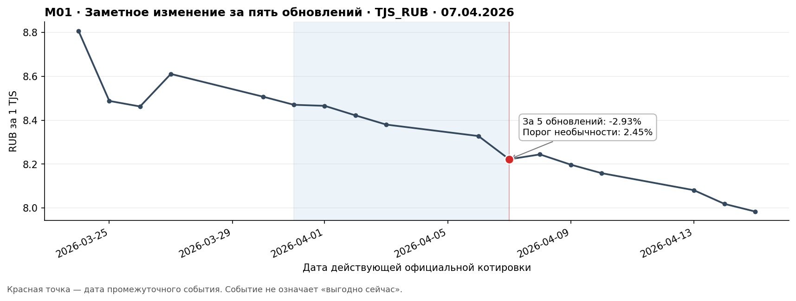
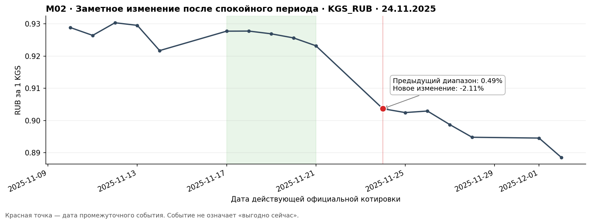
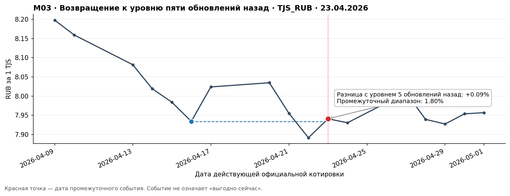
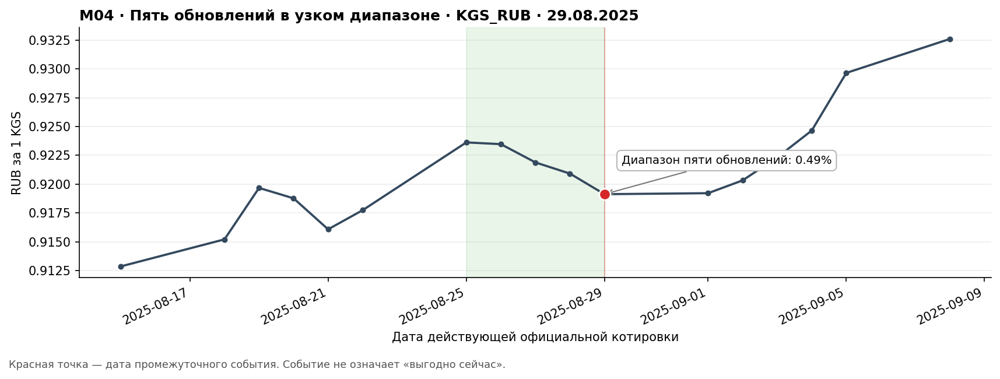
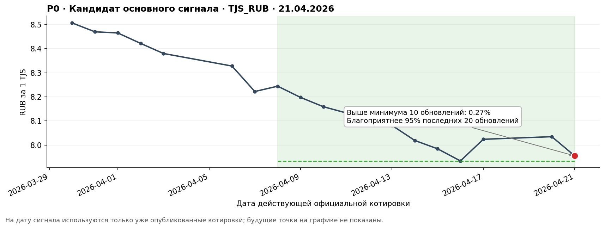

# Сигналы перед трансграничным переводом

> Версия после повторной сверки с `CASE.md`, рабочими персонами и офлайн-данными.
> Persona review проведён как критическая ролевая симуляция, а не как интервью
> с реальными клиентами. Спрос, понятность и бизнес-эффект подтверждаются только
> реальным исследованием и пилотом.

## 1. Итоговое продуктовое решение

Текущие M01–M04 нельзя выпускать как четыре самостоятельных push-сценария.
Они описывают график, но почти не отвечают на житейский вопрос клиента:
«зачем мне сейчас открывать перевод и сколько получит адресат?»

После аудита каталог разделён на три разных слоя:

| Слой | Роль | Решение |
| --- | --- | --- |
| **P0 — основной сигнал кейса** | Редко сообщает о статистически благоприятном моменте | Оставить и довести до полного walk-forward-бэктеста |
| **P1 — персональная реактивация** | Возвращает клиента к реально начатому, но не завершённому расчёту | Проверять только после появления данных банка; не считать доказательством хакатона |
| **Внутренние признаки** | Помогают ранжировать, объяснять и подавлять сообщения | M02 и M04 оставить внутри движка; клиенту отдельным push не отправлять |

Главное изменение позиции:

> Клиенту не нужен валютный контент. Ему нужно, чтобы банк сам заметил редкий
> полезный момент, привёл одним нажатием к актуальной сумме и не мешал срочному
> переводу.

Нейтральная гипотеза «рынок как-то изменился — возможно, клиент из любопытства
откроет расчёт» отклоняется для MVP. Она тратит дефицитный канал, а открытие из
любопытства не доказывает клиентскую ценность.

## 2. Что именно требует кейс

Каталог считается соответствующим основной задаче только если одновременно:

1. сигнал на дату `T` использует только сведения, доступные на `T`;
2. текст за две секунды объясняет направление, факт и одно действие;
3. утверждение имеет собственный truth-label, а не истинно «по определению»;
4. hit rate сравнивается со случайным днём того же коридора и периода;
5. matched lift устойчиво не ниже 1,3;
6. выгода момента в bps положительна и имеет доверительный интервал выше нуля;
7. проверены горизонты 1/3/5/10/20 и out-of-time-периоды;
8. поток прорежен и не образует серии;
9. публичный курс перед отправкой сверяется с исполнимыми условиями банка;
10. общий клиентский cap учитывает все банковские коммуникации, а не каждый
    валютный коридор отдельно.

M01–M04 причинно обнаруживают прошлые состояния, но это ещё не полный
walk-forward-бэктест из кейса: сейчас для них есть только `h=10`, нет
statement-specific labels на всех горизонтах и нет исполнимого курса банка.

## 3. Кому продукт действительно нужен

Сегментировать следует не по миграционному статусу, возрасту или стране
рождения, а по ситуации конкретного перевода.

| Персона | Реальная задача | Что скажет о рыночном push | Решение продукта |
| --- | --- | --- | --- |
| **Рустам — регулярный отправитель, дату можно сдвинуть** | Помочь семье в срок, получить больше местной валюты и не следить за курсом каждый день | «Скажите, что это меняет для перевода, а не что произошло на графике» | Целевая ситуация P0. Редкий фактический push и быстрый вход в расчёт |
| **Мадина — конкретный перевод срочный** | Отправить сейчас без сомнений и задержки | «Мне всё равно, хороший ли день: деньги нужны сегодня» | Не отправлять отрицательные и пограничные сигналы; обычный перевод всегда доступен |
| **Саида — получатель** | Получить достаточную сумму в договорённый срок | «Срок важнее попытки поймать ещё немного курса» | Не адресат push. Не использовать семью как эмоциональное давление |
| **Илья — владелец продукта** | Получить дополнительный объём и повторные переводы, не сжечь доверие | «Open rate не оправдывает обычный день» | Требует matched lift, holdout, net volume, margin и trust-guardrails |
| **Антон — разовая поездка, anti-persona** | Сравнить итог, комиссию и отправить сейчас | «После одной операции такое уведомление — реклама» | Не таргетировать первым продуктом |

Рабочий eligibility для будущего пилота:

- повторяющийся коридор или явно сохранённый интерес к направлению;
- есть вероятность, что дату конкретного перевода можно выбрать;
- перевод по этому намерению ещё не завершён;
- клиент не получил другой валютный push в cooldown;
- известна свежая исполнимая котировка;
- соблюдены opt-in и общий коммуникационный cap.

Регулярность сама по себе не доказывает эластичность: один и тот же человек в
одном месяце может выбирать день, а в другом отправлять срочно.

## 4. Повторный аудит прежних промежуточных сигналов

Matched baseline ниже — средняя вероятность `good` для случайного эффективного
обновления в том же `corridor × calendar year`, взвешенная как события сигнала.
Это корректнее общего pooled baseline 30,9%, использованного в предыдущей версии.

| ID | Реальный фрагмент и офлайн-данные | Критика от клиентской задачи | Вердикт |
| --- | --- | --- | --- |
| **M01 — заметное изменение за 5 обновлений**<br><br> | 746 событий; 0,378 на коридор-неделю; `good` 24,0% (95% CI 21,1–27,2%); matched baseline 31,1%; lift **0,77×**. Только при движении в пользу отправителя: 365 событий, `good` 48,8%, lift **1,51×**. На выбранном примере TJS 07.04.2026 рубль укрепился на 2,93%, но `good=False`, future regret 350 bps. | «Курс изменился» без направления — кликбейт. Даже благоприятный momentum может продолжиться: сообщение звучит хорошо, а через 10 дней условия оказываются лучше ещё на 3,5%. | **REWORK.** Неблагоприятную половину не отправлять. Благоприятный momentum использовать только вместе с подтверждением уровня и проверкой банковской котировки. |
| **M02 — изменение после спокойного периода**<br><br> | 97 событий; 0,049 на коридор-неделю; matched lift **1,00×**; в благоприятной половине **1,24×**, ниже gate 1,3. Пример KGS 24.11.2025: изменение −2,11%, `good=False`, regret 198 bps. | Клиенту не важно, был ли рынок до этого спокойным. Контраст интересен аналитику, но не решает задачу перевода. | **DROP как push.** Оставить только внутренним `priority_boost` для P0/P1. |
| **M03 — возвращение к уровню 5 обновлений назад**<br><br> | 425 событий; 0,215 на коридор-неделю; matched lift **0,89×**; благоприятная половина **1,13×**. | Пять обновлений назад не являются «знакомым уровнем»: клиент мог не открывать приложение и не видеть этот расчёт. | **DROP generic-версии.** Пересобрать как P1 только относительно фактического незавершённого расчёта клиента. |
| **M04 — 5 обновлений в узком диапазоне**<br><br> | 277 событий; 0,140 на коридор-неделю; matched lift **1,26×**; благоприятная половина **1,35×**, без отдельного OOT-подтверждения. | Прошлая стабильность не означает низкий курс и не обещает будущую стабильность. «Можно спокойно проверить» звучит как финансовое заверение. | **Не push.** Использовать как фильтр P0, признак риска устаревания или вторую строку in-app. |

Правдивость фразы «было заметное изменение / узкий диапазон» у M01–M04
тавтологична: событие так построено. Она не доказывает правдивость более важного
клиентского вывода «сейчас подходящий момент».

## 5. P0 — кандидат основного сигнала кейса

### 5.1. Клиентское обещание

> Банк сам следит за знакомым направлением и пишет только тогда, когда текущий
> уровень действительно благоприятен относительно недавней истории. Клиент
> одним нажатием проверяет актуальную сумму и сам решает, отправлять ли сейчас.

Черновик push после проверки исполнимой банковской котировки:

> **Сейчас по переводу в Таджикистан условия лучше, чем в большинство последних дней**
>
> Проверьте актуальную сумму к получению.

Допустимая более короткая версия:

> **Рубль сейчас силён к сомони**
>
> Проверьте актуальную сумму перевода.

Слова «семья», «близкие получат больше», точная сумма выгоды и предложение ждать
не используются без отдельного подтверждённого контекста.

### 5.2. Нулевая воспроизводимая версия правила

```text
dist_min_10 <= 1%
AND favourability_percentile_20 >= 80%
AND первое вхождение в состояние
AND прошло >= 4 дней с предыдущего валютного сигнала по коридору
```

Обе входные характеристики причинны: в расчёт входят только уже опубликованные
котировки. `good`, benefit и regret используются только после даты `T` как
ретроспективные метрики.



Пример TJS/RUB, 21.04.2026:

- курс был лишь на 0,27% выше минимума последних 10 обновлений;
- уровень был благоприятнее 95% последних 20 эффективных обновлений;
- `good=True`, future regret 80 bps, centered benefit 46 bps;
- при условном бюджете 15 000 RUB официальный прокси давал около 1 886 TJS —
  приблизительно на 75 TJS больше, чем при медианном курсе предыдущих 20
  обновлений.

Последний расчёт — только иллюстрация масштаба на официальном прокси. Его нельзя
показывать клиенту как сумму банка без актуальной котировки, комиссии и правил
исполнения.

### 5.3. Предварительные офлайн-метрики P0

| Scope | Событий | Событий / коридор-неделю | `good` | Matched lift | Mean benefit, bps (bootstrap 95% CI) | Median regret, bps |
| --- | ---: | ---: | ---: | ---: | ---: | ---: |
| Все данные | 550 | 0,279 | 56,7% | **1,72×** | 59,1 (49,8–68,9) | 81,8 |
| AMD_RUB | 106 | 0,269 | 56,6% | 1,72× | 52,7 (32,3–73,8) | 79,5 |
| KGS_RUB | 111 | 0,281 | 57,7% | 1,72× | 65,6 (43,5–91,6) | 76,0 |
| KZT_RUB | 118 | 0,299 | 59,3% | 1,81× | 70,4 (48,3–94,3) | 72,7 |
| TJS_RUB | 105 | 0,266 | 54,3% | 1,62× | 59,8 (39,0–82,4) | 90,7 |
| UZS_RUB | 110 | 0,279 | 55,5% | 1,74× | 45,9 (29,5–63,4) | 86,6 |

| Временной срез | Событий | `good` (95% CI) | Matched lift | Mean benefit, bps | Median regret, bps |
| --- | ---: | ---: | ---: | ---: | ---: |
| До 20.12.2023 | 344 | 57,3% (52,0–62,4%) | 1,58× | 58,9 | 82,7 |
| Validation 11.01–20.12.2024 | 65 | 60,0% (47,9–71,0%) | 2,10× | 69,3 | 79,4 |
| Test с 11.01.2025 | 132 | 51,5% (43,1–59,9%) | 1,96× | 49,6 | 86,5 |

P0 проходит первичный gate `lift ≥ 1,3` на этом `h=10` и показывает
положительную среднюю выгоду с bootstrap-CI выше нуля. Но это **кандидат, а не
финально доказанный сигнал**: до заявления о закрытии кейса нужны горизонты
1/3/5/10/20, corridor-specific walk-forward-калибровка, purge/embargo, сравнение
быстрого и медленного подтверждения и проверка statement-specific truth.

Частота 0,279 события на коридор-неделю ниже ориентира 1–2. Для качества это не
повод ослаблять P0: редкий честный сигнал лучше заполнения недельной квоты
событиями, которые не решают клиентскую задачу. Недостающий контакт проверяется
отдельным P1 на банковских данных, а не ухудшением основного сигнала.

## 6. P1 — персональная реактивация, а не рыночная новость

### 6.1. Гипотеза

> Если клиент недавно рассчитал перевод и не завершил его, а актуальная сумма к
> получению стала не хуже просмотренной, то нейтральное напоминание увеличит
> недельную долю клиентов, вернувшихся к расчёту, без роста давления и opt-out.

Push:

> **Условия по вашему направлению снова близки к недавнему расчёту**
>
> Обновить сумму к получению?

Более сильная версия разрешена только при проверяемом улучшении:

> **По вашему недавнему расчёту условия улучшились**
>
> Проверьте актуальную сумму к получению.

Нельзя писать «знакомый уровень» по произвольному `lag_5`. Якорем является
реальный `anchor_quote_id`, который клиент действительно видел.

### 6.2. Данные и правило

| Нужный слой | Поля | Назначение |
| --- | --- | --- |
| История расчёта | `anchor_quote_id`, `anchor_quote_at`, `corridor`, подтверждённая сумма или безопасный bucket | Доказывает реальное намерение и опорный уровень |
| Состояние задачи | отсутствие `transfer_completed`, возраст расчёта, washout после завершения | Не возвращать к уже выполненному переводу |
| Исполнимая котировка | `current_quote_id`, rate, fee, recipient amount, freshness | Сравнить реальный результат, а не официальный прокси |
| Коммуникации | delivered push за rolling 7 days, cooldown, suppress reason | Не превысить общий cap |
| Эксперимент | assignment, eligibility, delivery, open, quote calculation, completion, margin, opt-out | Измерить причинный эффект |

Нулевая логика eligibility:

```text
расчёт был 2–14 дней назад
AND перевод после него не завершён
AND current_recipient_amount >= anchor_recipient_amount - tolerance
AND нет более сильного P0
AND нет расчёта или валютного push последние 3–4 дня
```

Порог, окно и допустимость персонализации не подтверждены текущими открытыми
данными. Поэтому P1 — дизайн пилота, а не результат текущего бэктеста.

### 6.3. Ценность

| Для клиента | Для банка |
| --- | --- |
| Возврат к собственной незавершённой задаче, а не рассказ о рынке | Реактивация уже проявленного намерения ближе к операции, чем общий market-content |
| Один tap до свежей суммы | Инкрементальные расчёты и завершённые переводы |
| Нет необходимости помнить прошлый курс | Дополнительный net volume и contribution margin |
| Решение остаётся у клиента, срочный путь не блокируется | Повторное использование без покупки открытий ценой доверия |

Риск — ощущение слежки. В push не показываются получатель, старая сумма и
семейная роль; допустимость такой персонализации проверяется concept-test.

## 7. Полная продуктовая гипотизация

| ID | Нулевая гипотеза | Клиентская ценность | Ценность банка | Данные | Primary | Kill / rework criterion |
| --- | --- | --- | --- | --- | --- | --- |
| **H-P0** | Level + favorability rule не лучше matched random day и не оправдывает push | Не следить за курсом; быстро проверить актуальную сумму в редкий благоприятный момент | Захват переносимого спроса и рост доли кошелька | Открытый ряд + executable quote + eligibility | Офлайн: matched lift и benefit; пилот: incremental quote-check и completed transfer reach | Lift <1,3 на OOT/коридорах; benefit CI пересекает 0; плохая исполнимая котировка |
| **H-P1** | Реактивация прошлого расчёта не создаёт дополнительного действия | Вернуться к собственной незавершённой задаче | Дополнительные завершённые переводы и margin | Внутренние quote/transfer/event данные | `weekly_incremental_quote_check_reach` | Нет uplift; только сдвиг времени; растут opt-out или ощущение слежки |
| **H-M02** | Контраст после спокойствия сам по себе не стоит push-слота | Нет самостоятельной доказанной ценности | Возможен `priority_boost`, если улучшает P0/P1 | Открытый ряд + ablation | Δ lift/benefit P0 после добавления признака | Нет устойчивого прироста — удалить из ранжирования |
| **H-M04** | Узкий диапазон не нужен как push, но может уменьшить риск устаревания | Меньше открытий, где условия уже резко изменились | Защита доверия и следующего сильного сигнала | Range-признак + latency + executable quote | Доля stale/worse-at-open | Не снижает stale-risk — удалить |
| **H-SILENCE** | Молчание в пограничный день лучше нейтрального рыночного push | Нет лишнего шума и давления | Сохраняет дефицитный канал | Policy eligibility + holdout | Реакция на следующий P0, opt-out | Нейтральный push даёт устойчивый incremental business value без вреда — пересмотреть |

## 8. Метрики: от правдивости к деньгам

Нельзя одной метрикой одновременно доказать качество рынка, внимание клиента и
ценность банка. Они измеряются последовательно.

| Уровень | Метрика | Что доказывает |
| --- | --- | --- |
| Офлайн truth | hit rate, matched lift, benefit bps, regret, CI, OOT | Сигнал лучше обычного дня и утверждение не вводит в заблуждение |
| Частота | events/corridor-week, gaps, clustering, suppress rate | Детектор технически пригоден для коммуникационного потока |
| Leading | `weekly_incremental_open_reach` | Push создаёт дополнительный контакт, а не просто высокий CTR среди открывших |
| Primary P1 | `weekly_incremental_quote_check_reach` | Клиент действительно проверил актуальную сумму |
| Intent quality | `quote_check_to_transfer_start_7d` | Проверки не являются пустыми кликами |
| Business | `incremental_completed_transfer_reach_28d` | Появились дополнительные операции |
| Business | `incremental_net_volume_28d` | Это не только перенос уже запланированного перевода на другой день |
| Economics | `incremental_contribution_margin_28d` | Дополнительный маржинальный доход после затрат |
| Retention | `repeat_transfer_rate_60/90d` | Клиент возвращается к банку для следующих переводов |
| Trust | opt-out, complaint, mute, next-P0 response | Краткосрочный клик не куплен ценой канала |

```text
weekly_incremental_quote_check_reach =
  P(>=1 meaningful quote calculation | test, eligible user-week)
  - P(>=1 meaningful quote calculation | control, eligible user-week)

incremental_contribution_margin_28d =
  [net_volume_28d(test) - net_volume_28d(control)]
  * contribution_margin_rate
  - incremental_communication_and_service_cost
```

Открытые push за неделю — полезная leading-метрика, но не конечный результат.
Количество открытий растёт механически вместе с количеством сообщений, поэтому
causal unit — все рандомизированные `eligible user-week`, включая неоткрывших.

## 9. Частотный контракт

Лимит относится к доставленным сообщениям на клиента, не к открытым push и не к
каждому коридору отдельно.

```text
target: 0–2 валютных push на клиента за rolling 7 days
exception: третий только для P0 при заранее заданной policy
hard cap: >3 невозможно
cooldown: минимум 4 дня от любого валютного push
priority: P0 > P1 > внутренние признаки
```

Контролируются mean/P50/P95 доставок, доли клиентов с 0/1/2/3 сообщениями,
`share >2`, `share >3`, причины подавления и конкуренция с другими сообщениями
банка. История одного коридора не может доказать соблюдение client-level cap.

## 10. Экспериментальный дизайн

### 10.1. До пилота

- comprehension test на реальных регулярных отправителях: после двух секунд
  человек правильно говорит, что изменилось, что банк обещает и что предлагает;
- отдельно проверить ощущение давления у срочного сценария;
- проверить P0 на всех горизонтах и walk-forward-периодах;
- проверить разрыв между официальным и исполнимым курсом;
- зафиксировать MDE и stop conditions.

### 10.2. Policy test

Постоянная рандомизация на уровне клиента на 8–12 недель:

| Группа | Коммуникация | Что проверяется |
| --- | --- | --- |
| Control | Только доказанный P0 | Фоновая активность и ценность основного сигнала |
| Test P1 | P0 + персональная реактивация | Добавляет ли P1 расчёты и операции сверх P0 |
| Active control | P0 + нейтральный факт при сходной частоте | Действительно ли персональная релевантность, а не дополнительный push, создаёт эффект |

Рандомизация стратифицируется по коридору, прошлой частоте переводов и baseline
quote activity. Анализ — intent-to-treat. Для 28-дневных outcomes используется
первый eligibility-event после washout, чтобы окна одного клиента не
перекрывались.

## 11. События аналитики

Общие поля: `event_id`, `event_ts_utc`, `user_id_pseudonymized`, `corridor`,
`experiment_id`, `variant`, `assignment_id`, `eligibility_id`, `signal_id`,
`signal_rule_version`, `user_local_week_id`.

| Event | Дополнительные поля |
| --- | --- |
| `signal_eligible` | direction, strength_bps, threshold, source timestamp, executable quote freshness, relevance reason |
| `signal_suppressed` | reason, rolling-7d count, previous push time, higher-priority signal |
| `push_sent/delivered/opened` | message id, copy version, rank, delivery/open latency |
| `corridor_deeplink_opened` | expected corridor, actual corridor |
| `quote_loaded` | quote id, executable rate time, delta from push in bps, status `актуально/изменилось/неизвестно` |
| `amount_confirmed` | quote id, amount bucket |
| `quote_calculated` | recipient amount shown flag, calculated time |
| `transfer_started/completed` | transfer id, quote id, amount bucket, fee, contribution margin |
| `transfer_cancelled/failed` | reason |
| `notification_opt_out/complaint` | message id, reason |
| `next_primary_signal_response` | sent/opened/calculated/completed for the next P0 |

Для P1 дополнительно: `anchor_quote_id`, `anchor_quote_at`,
`current_vs_anchor_bps`. Старую сумму и получателя не следует выводить в широкий
аналитический контур или текст push.

## 12. Guardrails и запрещённые формулировки

| Не писать | Почему | Допустимо |
| --- | --- | --- |
| «Курс заметно изменился» без направления | Кликбейт: клиент не понимает, стало ли ему лучше | «Условия по вашему направлению улучшились» — только после проверки executable quote |
| «После спокойного периода…» | Рыночный контекст без клиентской задачи | Использовать M02 внутри ранжирования |
| «Курс зафиксировался», «можно переводить спокойно» | Обещает будущую стабильность | «За последние пять обновлений диапазон составил X%» только in-app |
| «Успейте», «переведите сегодня» | Создаёт FOMO и давление | «Проверьте актуальную сумму» |
| «Близкий получит больше» | Может давить через семью; контекст не подтверждён | Нейтральное «сумма к получению» |
| «Лучший курс», «точно выгодно», «курс продолжит…» | Непроверяемая гарантия и прогноз | Относительный факт о прошедшем периоде |
| «Снова знакомый уровень» без `anchor_quote_id` | Притворная персонализация | «Снова близко к вашему недавнему расчёту» при доказанном anchor |

При неизвестной свежести банковской котировки сообщение подавляется. После
открытия обычный путь перевода остаётся равноправным; продукт никогда не требует
обосновывать срочность или ждать следующего сигнала.

## 13. Что подтверждают текущие данные

| Утверждение | Статус | Доказательство |
| --- | --- | --- |
| M01–M04 можно причинно обнаружить на дате T | Подтверждено технически | Trailing-признаки, `shift(1)` для порогов, first-entry и effective updates |
| Все M01–M04 заслуживают push | Опровергнуто текущим аудитом | Matched lift и persona/job critique |
| P0 является сильным кандидатом | Предварительно подтверждено на `h=10` | Lift 1,72, benefit CI >0, все пять коридоров >1,6 |
| P0 полностью закрывает CASE | Не подтверждено | Нет полного набора горизонтов и финального walk-forward protocol |
| P1 повысит расчёты и переводы | Неизвестно | Нет клиентских и банковских данных; нужен pilot holdout |
| Мигранты как демография — правильный target | Не подтверждено | Персоны требуют поведенческой сегментации |
| Нейтральный market-content создаёт полезное касание | Не подтверждено и не рекомендуется для MVP | Open rate не равен пользе, а канал ограничен |

## 14. Воспроизводимость

- Скрипт: [build_intermediate_signal_report.py](../scripts/build_intermediate_signal_report.py)
- Метрики аудита M01–M04:
  [intermediate_signal_metrics.csv](product_signal_examples/intermediate_signal_metrics.csv)
- Полные события M01–M04:
  [intermediate_signal_events.csv](product_signal_examples/intermediate_signal_events.csv)
- Метрики P0:
  [case_signal_candidate_metrics.csv](product_signal_examples/case_signal_candidate_metrics.csv)
- События P0:
  [case_signal_candidate_events.csv](product_signal_examples/case_signal_candidate_events.csv)
- Разрезы по коридорам:
  [intermediate_signal_metrics_by_corridor.csv](product_signal_examples/intermediate_signal_metrics_by_corridor.csv)
- Пересечения и частотная policy:
  [intermediate_signal_overlap.csv](product_signal_examples/intermediate_signal_overlap.csv),
  [intermediate_signal_policy_metrics.csv](product_signal_examples/intermediate_signal_policy_metrics.csv)

Источники решений: [CASE.md](CASE.md), [персоны](personas/README.md),
[AI CustDev synthesis](interviews/AI_CUSTDEV_REINTERVIEW_SYNTHESIS.md),
[01_fx_features_eda.ipynb](../notebooks/01_fx_features_eda.ipynb),
[base_feature_dictionary.md](base_feature_dictionary.md),
[cross_currency_methodology.md](cross_currency_methodology.md),
[golden_label_methodology.md](golden_label_methodology.md) и
[dataset_card.md](dataset_card.md).
